# Bill of materials

This page includes an aggregated overview (incl. images) of all the parts needed to build the CNC-machine. To get a better understanding of how the parts are used (additional comments etc), check the following detailed spreadsheet:

* [On Google drive](https://docs.google.com/spreadsheets/d/1VdnPilA22OfAh9a1y4Ft6c2xkio206Dzv85h7AX7CmQ/edit?usp=sharing)
* [Bill\_of\_material.xlsx](./Bill_of_material.xlsx)

The 3d-printed parts were printed in standard PLA using:

* 30% infill
* 4 top solid horizontal layers
* 4 bottom solid horizontal layers
* 4 perimeters

The complete PrusaSlicer config used can be found here: [prusa\_slicer\_config.ini](./prusa_slicer_config.ini)

## 3d-printed parts

| Item No. | Type                                      | Amount | Image                                                                                                                                                   | STL-file                                                                                                                         | OBJ-file                                                                                                                         |
|----------|-------------------------------------------|--------|---------------------------------------------------------------------------------------------------------------------------------------------------------|----------------------------------------------------------------------------------------------------------------------------------|----------------------------------------------------------------------------------------------------------------------------------|
| P01      | Back middle panel (large electronic box)  | 1      | Missing                                                                                                                                                 | [middle\_back\_panel\_electronic\_box\_large.stl](./stl_files/electronic_box_large/middle_back_panel_electronic_box_large.stl)   | [middle\_back\_panel\_electronic\_box\_large.obj](./obj_files/electronic_box_large/middle_back_panel_electronic_box_large.obj)   |
| P02      | Back middle panel (small electronic box)  | 1      |    | [middle\_back\_panel\_electronic\_box\_small.stl](./stl_files/electronic_box_small/middle_back_panel_electronic_box_small.stl)   | [middle\_back\_panel\_electronic\_box\_small.obj](./obj_files/electronic_box_small/middle_back_panel_electronic_box_small.obj)   |
| P03      | Back panel (large electronic box)         | 1      | 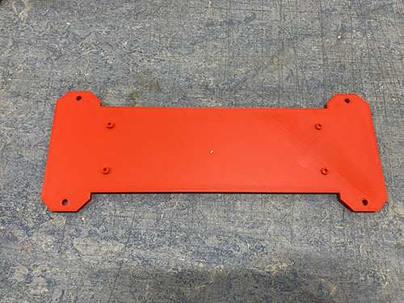                 | [back\_panel\_electronic\_box\_large.stl](./stl_files/electronic_box_large/back_panel_electronic_box_large.stl)                  | [back\_panel\_electronic\_box\_large.obj](./obj_files/electronic_box_large/back_panel_electronic_box_large.obj)                  |
| P04      | Back panel (small electronic box)         | 1      |                  | [back\_panel\_electronic\_box\_small.stl](./stl_files/electronic_box_small/back_panel_electronic_box_small.stl)                  | [back\_panel\_electronic\_box\_small.obj](./obj_files/electronic_box_small/back_panel_electronic_box_small.obj)                  |
| P05      | Cable chain mount                         | 1      |                                                                | [Y\_CHAIN\_BOTTOM\_BRACKET\_SUPPORT\_1.stl](./stl_files/other/Y_CHAIN_BOTTOM_BRACKET_SUPPORT_1.stl)                              | [Y\_CHAIN\_BOTTOM\_BRACKET\_SUPPORT\_1.obj](./obj_files/other/Y_CHAIN_BOTTOM_BRACKET_SUPPORT_1.obj)                              |
| P06      | Cable chain support                       | 1      |                                                            | [Y\_CHAIN\_BOTTOM\_BRACKET\_SUPPORT\_2.stl](./stl_files/other/Y_CHAIN_BOTTOM_BRACKET_SUPPORT_2.stl)                              | [Y\_CHAIN\_BOTTOM\_BRACKET\_SUPPORT\_2.obj](./obj_files/other/Y_CHAIN_BOTTOM_BRACKET_SUPPORT_2.obj)                              |
| P07      | Carriage                                  | 1      |                                                                                                | [CARRIAGE.stl](./stl_files/router/CARRIAGE.stl)                                                                                  | [CARRIAGE.obj](./obj_files/router/CARRIAGE.obj)                                                                                  |
| P08      | End-stop mount (ordinary)                 | 3      | 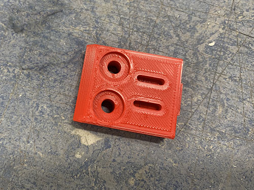                                                                 | [ENDSTOP\_LIMIT\_SWITCH.stl](./stl_files/other/ENDSTOP_LIMIT_SWITCH.stl)                                                         | [ENDSTOP\_LIMIT\_SWITCH.obj](./obj_files/other/ENDSTOP_LIMIT_SWITCH.obj)                                                         |
| P09      | End-stop mount (tall)                     | 1      |                                                                          | [Y\_AXIS\_ENDSTOP\_LIMIT\_SWITCH\_LONG.stl](./stl_files/other/Y_AXIS_ENDSTOP_LIMIT_SWITCH_LONG.stl)                              | [Y\_AXIS\_ENDSTOP\_LIMIT\_SWITCH\_LONG.obj](./obj_files/other/Y_AXIS_ENDSTOP_LIMIT_SWITCH_LONG.obj)                              |
| P10      | End-stop mount (thick)                    | 1      |                                                                        | [X\_AXIS\_ENDSTOP\_LIMIT\_SWITCH\_THICK.stl](./stl_files/other/X_AXIS_ENDSTOP_LIMIT_SWITCH_THICK.stl)                            | [X\_AXIS\_ENDSTOP\_LIMIT\_SWITCH\_THICK.obj](./obj_files/other/X_AXIS_ENDSTOP_LIMIT_SWITCH_THICK.obj)                            |
| P11      | Flexible conduit strain relief (halves)   | 8      | 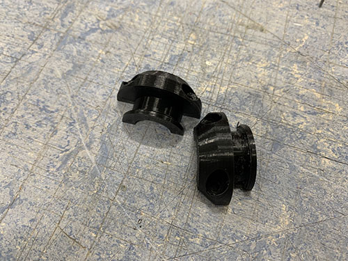                                                                         | [CABLE\_STRAIN\_RELIEF.stl](./stl_files/other/CABLE_STRAIN_RELIEF.stl)                                                           | [CABLE\_STRAIN\_RELIEF.obj](./obj_files/other/CABLE_STRAIN_RELIEF.obj)                                                           |
| P12      | Front middle panel (large electronic box) | 1      | 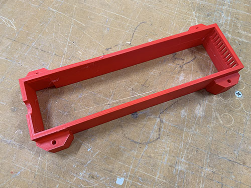 | [middle\_front\_panel\_electronic\_box\_large.stl](./stl_files/electronic_box_large/middle_front_panel_electronic_box_large.stl) | [middle\_front\_panel\_electronic\_box\_large.obj](./obj_files/electronic_box_large/middle_front_panel_electronic_box_large.obj) |
| P13      | Front middle panel (small electronic box) | 1      |  | [middle\_front\_panel\_electronic\_box\_small.stl](./stl_files/electronic_box_small/middle_front_panel_electronic_box_small.stl) | [middle\_front\_panel\_electronic\_box\_small.obj](./obj_files/electronic_box_small/middle_front_panel_electronic_box_small.obj) |
| P14      | Front panel (large electronic box)        | 1      |                | [front\_panel\_electronic\_box\_large.stl](./stl_files/electronic_box_large/front_panel_electronic_box_large.stl)                | [front\_panel\_electronic\_box\_large.obj](./obj_files/electronic_box_large/front_panel_electronic_box_large.obj)                |
| P15      | Front panel (small electronic box)        | 1      |                | [front\_panel\_electronic\_box\_small.stl](./stl_files/electronic_box_small/front_panel_electronic_box_small.stl)                | [front\_panel\_electronic\_box\_small.obj](./obj_files/electronic_box_small/front_panel_electronic_box_small.obj)                |
| P16      | Idler block                               | 3      | 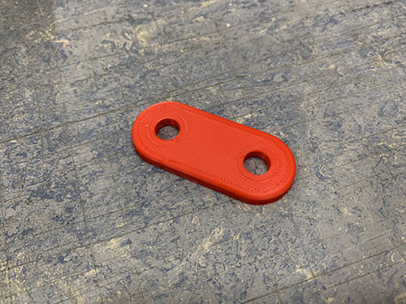                                                                                         | [IDLER\_BLOCK.stl](./stl_files/other/IDLER_BLOCK.stl)                                                                            | [IDLER\_BLOCK.obj](./obj_files/other/IDLER_BLOCK.obj)                                                                            |
| P17      | Left belt tension slider                  | 1      |                                        | [Y\_AXIS\_LEFT\_BELT\_TENSIONER.stl](./stl_files/belt_tensioner/y_axis_left/Y_AXIS_LEFT_BELT_TENSIONER.stl)                      | [Y\_AXIS\_LEFT\_BELT\_TENSIONER.obj](./obj_files/belt_tensioner/y_axis_left/Y_AXIS_LEFT_BELT_TENSIONER.obj)                      |
| P18      | Left belt tensioner                       | 1      | 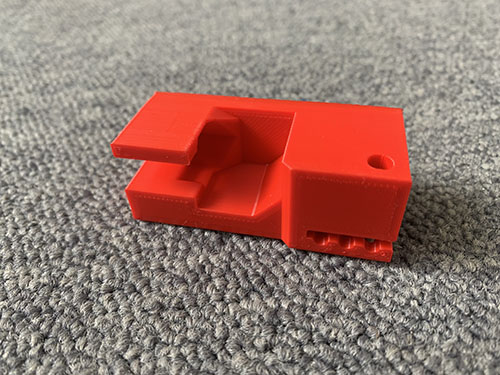                                                     | [Y\_AXIS\_LEFT\_FRONT\_CLIP.stl](./stl_files/belt_tensioner/y_axis_left/Y_AXIS_LEFT_FRONT_CLIP.stl)                              | [Y\_AXIS\_LEFT\_FRONT\_CLIP.obj](./obj_files/belt_tensioner/y_axis_left/Y_AXIS_LEFT_FRONT_CLIP.obj)                              |
| P19      | Left fixed belt tensioner                 | 1      | 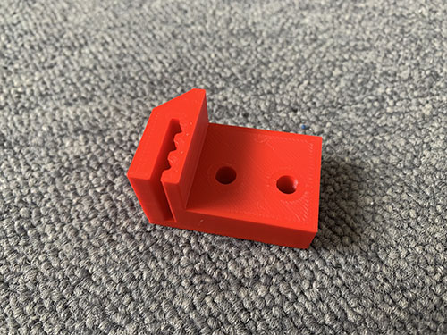                                         | [Y\_AXIS\_LEFT\_BACK\_CLIP.stl](./stl_files/belt_tensioner/y_axis_left/Y_AXIS_LEFT_BACK_CLIP.stl)                                | [Y\_AXIS\_LEFT\_BACK\_CLIP.obj](./obj_files/belt_tensioner/y_axis_left/Y_AXIS_LEFT_BACK_CLIP.obj)                                |
| P20      | Left side plate                           | 1      |                                                                     | [LEFT\_PLATE.stl](./stl_files/side_plates/left/LEFT_PLATE.stl)                                                                   | [LEFT\_PLATE.obj](./obj_files/side_plates/left/LEFT_PLATE.obj)                                                                   |
| P21      | Left side plate lower back clip           | 1      |                           | [LEFT\_PLATE\_BACK\_CLIP.stl](./stl_files/side_plates/left/LEFT_PLATE_BACK_CLIP.stl)                                             | [LEFT\_PLATE\_BACK\_CLIP.obj](./obj_files/side_plates/left/LEFT_PLATE_BACK_CLIP.obj)                                             |
| P22      | Left side plate lower front clip          | 1      | 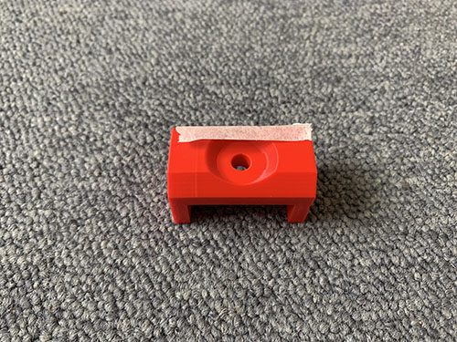                        | [LEFT\_PLATE\_LOWER\_FRONT\_CLIP.stl](./stl_files/side_plates/left/LEFT_PLATE_LOWER_FRONT_CLIP.stl)                              | [LEFT\_PLATE\_LOWER\_FRONT\_CLIP.obj](./obj_files/side_plates/left/LEFT_PLATE_LOWER_FRONT_CLIP.obj)                              |
| P23      | Left side plate upper front clip          | 1      |                         | [LEFT\_PLATE\_UPPER\_FRONT\_CLIP.stl](./stl_files/side_plates/left/LEFT_PLATE_UPPER_FRONT_CLIP.stl)                              | [LEFT\_PLATE\_UPPER\_FRONT\_CLIP.obj](./obj_files/side_plates/left/LEFT_PLATE_UPPER_FRONT_CLIP.obj)                              |
| P24      | Milling router bracket                    | 1      |                                                                                    | [ROUTER\_BRACKET.stl](./stl_files/router/ROUTER_BRACKET.stl)                                                                     | [ROUTER\_BRACKET.obj](./obj_files/router/ROUTER_BRACKET.obj)                                                                     |
| P25      | Rail support                              | 3      | 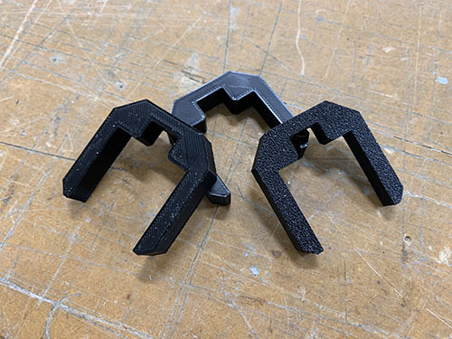                                                                                     | [RAILS\_SUPPORT.stl](./stl_files/other/RAILS_SUPPORT.stl)                                                                        | [RAILS\_SUPPORT.obj](./obj_files/other/RAILS_SUPPORT.obj)                                                                        |
| P26      | Right belt tension slider                 | 1      | 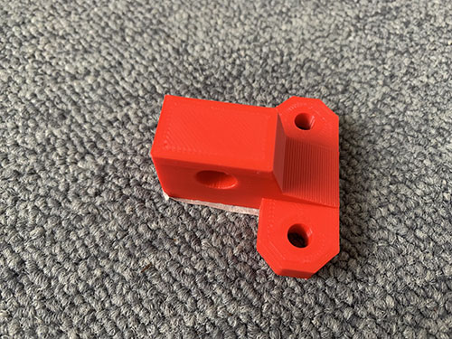                                     | [Y\_AXIS\_RIGHT\_BELT\_TENSIONER.stl](./stl_files/belt_tensioner/y_axis_right/Y_AXIS_RIGHT_BELT_TENSIONER.stl)                   | [Y\_AXIS\_RIGHT\_BELT\_TENSIONER.obj](./obj_files/belt_tensioner/y_axis_right/Y_AXIS_RIGHT_BELT_TENSIONER.obj)                   |
| P27      | Right belt tensioner                      | 2      | 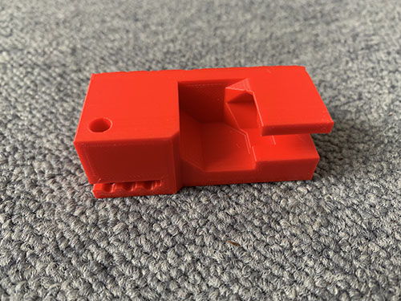                                                   | [Y\_AXIS\_RIGHT\_FRONT\_CLIP.stl](./stl_files/belt_tensioner/y_axis_right/Y_AXIS_RIGHT_FRONT_CLIP.stl)                           | [Y\_AXIS\_RIGHT\_FRONT\_CLIP.obj](./obj_files/belt_tensioner/y_axis_right/Y_AXIS_RIGHT_FRONT_CLIP.obj)                           |
| P28      | Right fixed belt tensioner                | 2      |                                        | [Y\_AXIS\_RIGHT\_BACK\_CLIP.stl](./stl_files/belt_tensioner/y_axis_right/Y_AXIS_RIGHT_BACK_CLIP.stl)                             | [Y\_AXIS\_RIGHT\_BACK\_CLIP.obj](./obj_files/belt_tensioner/y_axis_right/Y_AXIS_RIGHT_BACK_CLIP.obj)                             |
| P29      | Right side plate                          | 1      |                                                                  | [RIGHT\_PLATE.stl](./stl_files/side_plates/right/RIGHT_PLATE.stl)                                                                | [RIGHT\_PLATE.obj](./obj_files/side_plates/right/RIGHT_PLATE.obj)                                                                |
| P30      | Right side plate lower back clip          | 1      |                        | [RIGHT\_PLATE\_BACK\_CLIP.stl](./stl_files/side_plates/right/RIGHT_PLATE_BACK_CLIP.stl)                                          | [RIGHT\_PLATE\_BACK\_CLIP.obj](./obj_files/side_plates/right/RIGHT_PLATE_BACK_CLIP.obj)                                          |
| P31      | Right side plate lower front clip         | 1      |                      | [RIGHT\_PLATE\_LOWER\_FRONT\_CLIP.stl](./stl_files/side_plates/right/RIGHT_PLATE_LOWER_FRONT_CLIP.stl)                           | [RIGHT\_PLATE\_LOWER\_FRONT\_CLIP.obj](./obj_files/side_plates/right/RIGHT_PLATE_LOWER_FRONT_CLIP.obj)                           |
| P32      | Right side plate upper front clip         | 1      |                      | [RIGHT\_PLATE\_UPPER\_FRONT\_CLIP.stl](./stl_files/side_plates/right/RIGHT_PLATE_UPPER_FRONT_CLIP.stl)                           | [RIGHT\_PLATE\_UPPER\_FRONT\_CLIP.obj](./obj_files/side_plates/right/RIGHT_PLATE_UPPER_FRONT_CLIP.obj)                           |
| P33      | USB lock                                  | 1      |                                                                                        | [USB\_LOCK.stl](./stl_files/other/USB_LOCK.stl)                                                                                  | [USB\_LOCK.obj](./obj_files/other/USB_LOCK.obj)                                                                                  |
| P34      | Vaccum funnel                             | 1      | 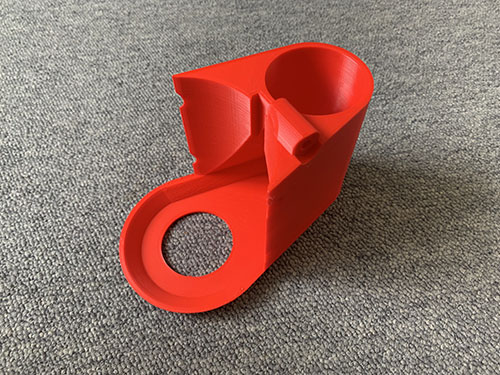                                                                                     | [VACUUM\_FUNNEL.stl](./stl_files/router/VACUUM_FUNNEL.stl)                                                                       | [VACUUM\_FUNNEL.obj](./obj_files/router/VACUUM_FUNNEL.obj)                                                                       |
| P35      | Vaccum hose ring                          | 1      |                                                                                | [VACUUM\_HOSE\_RING.stl](./stl_files/router/VACUUM_HOSE_RING.stl)                                                                | [VACUUM\_HOSE\_RING.obj](./obj_files/router/VACUUM_HOSE_RING.obj)                                                                |
| P36      | Vertical carriage slider                  | 1      | 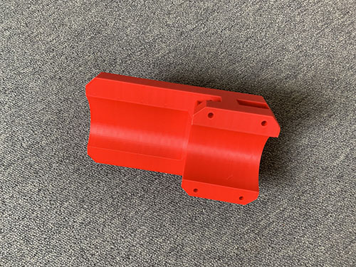                                                               | [VERTICAL\_SLIDER.stl](./stl_files/router/VERTICAL_SLIDER.stl)                                                                   | [VERTICAL\_SLIDER.obj](./obj_files/router/VERTICAL_SLIDER.obj)                                                                   |
| P37      | Wasteboard bracket                        | 7      |                                                                        | [BRACKET.stl](./stl_files/other/BRACKET.stl)                                                                                     | [BRACKET.obj](./obj_files/other/BRACKET.obj)                                                                                     |
| P38      | X-axis cable chain mount                  | 1      | 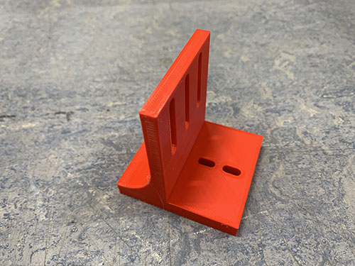                                                               | [CABLE\_CHAIN\_MOUNT.stl](./stl_files/router/CABLE_CHAIN_MOUNT.stl)                                                              | [CABLE\_CHAIN\_MOUNT.obj](./obj_files/router/CABLE_CHAIN_MOUNT.obj)                                                              |
| P39      | Z-axis end-stop trigger                   | 1      | 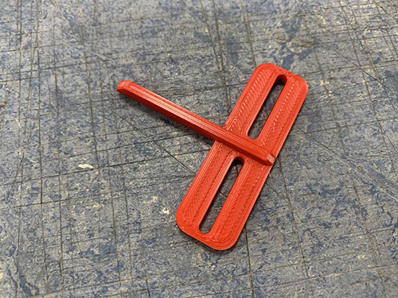                                                                                 | [Z\_END\_STOP\_TRIGGER.stl](./stl_files/other/Z_END_STOP_TRIGGER.stl)                                                            | [Z\_END\_STOP\_TRIGGER.obj](./obj_files/other/Z_END_STOP_TRIGGER.obj)                                                            |
| P40      | Z-axis stepper motor mount                | 1      |                                                                                      | [Z\_MOTOR\_MOUNT.stl](./stl_files/router/Z_MOTOR_MOUNT.stl)                                                                      | [Z\_MOTOR\_MOUNT.obj](./obj_files/router/Z_MOTOR_MOUNT.obj)                                                                      |

## Screws

| Item No. | Size  | Length | Amount | Image                                                                 |
|----------|-------|--------|--------|-----------------------------------------------------------------------|
| S01      | 3.5mm | 20mm   | 14     |  |
| S02      | M3    | 12mm   | 20     |           |
| S03      | M3    | 16mm   | 96     | 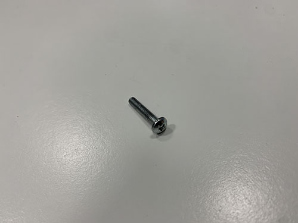          |
| S04      | M3    | 20mm   | 32     |           |
| S05      | M3    | 25mm   | 36     |           |
| S06      | M3    | 40mm   | 12     | 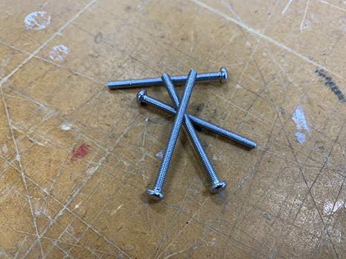          |
| S07      | M3    | 5mm    | 8      | 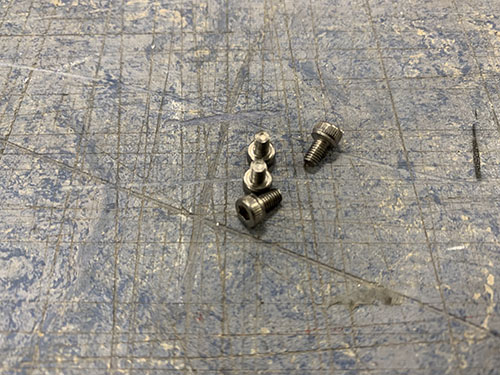            |
| S08      | M3    | 8mm    | 4      |             |
| S09      | M4    | 18mm   | 2      | 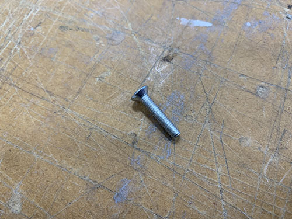          |
| S10      | M4    | 25mm   | 19     |           |
| S11      | M4    | 40mm   | 8      |           |
| S12      | M5    | 20mm   | 26     |           |
| S13      | M5    | 40mm   | 6      | 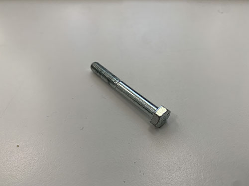          |
| S14      | M5    | 60mm   | 2      |           |
| S17      | M5    | 80mm   | 1      | 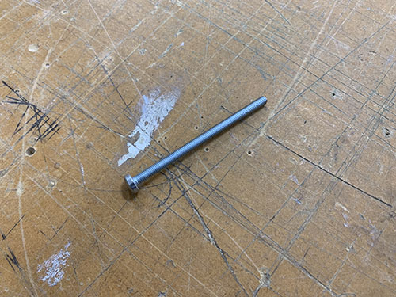          |
| S15      | M8    | 60mm   | 9      | 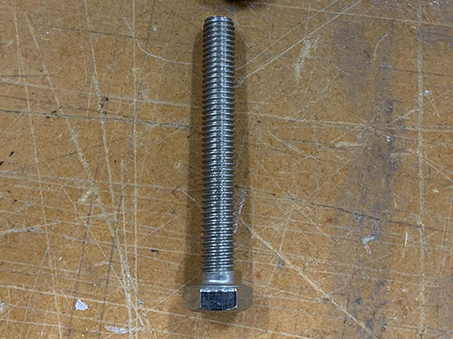          |
| S16      | M8    | 80mm   | 2      |           |

## Nuts

| Item No. | Size | Amount | Image                                         |
|----------|------|--------|-----------------------------------------------|
| N01      | M4   | 11     | 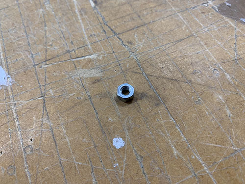 |
| N02      | M5   | 15     | 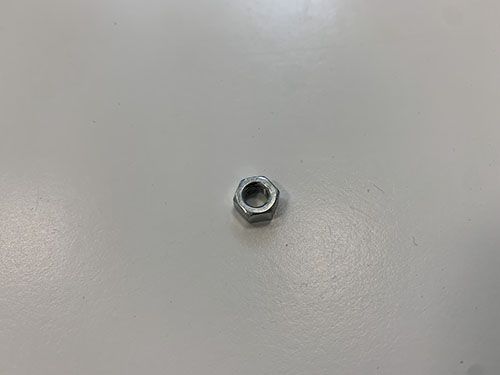 |
| N03      | M8   | 35     |  |

## Washers

| Item No. | Outer diameter | Inner diameter | Thickness | Amount | Image                                                                        |
|----------|----------------|----------------|-----------|--------|------------------------------------------------------------------------------|
| W01      | 10mm           | 5mm            | 1mm       | 13     | 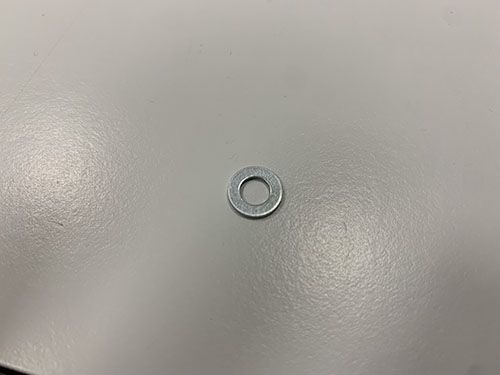         |
| W02      | 15mm           | 5mm            | 1mm       | 14     | 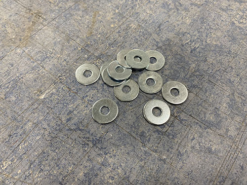         |
| W03      | 15mm           | 8.5mm          | 1.5mm     | 24     | 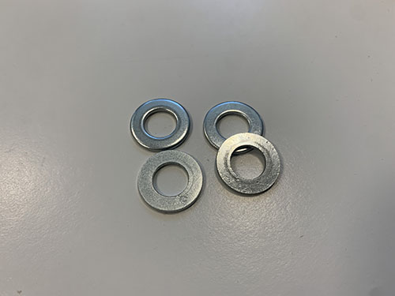 |
| W04      | 20mm           | 10mm           | 2mm       | 27     |        |
| W05      | 8mm            | 4mm            | 0.5mm     | 12     | 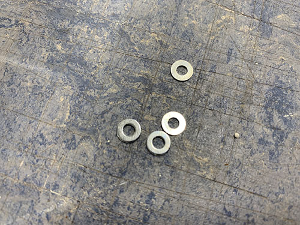       |
| W06      | 8mm            | 4mm            | 1mm       | 4      |            |
| W07      | 9mm            | 4.5mm          | 1mm       | 2      | 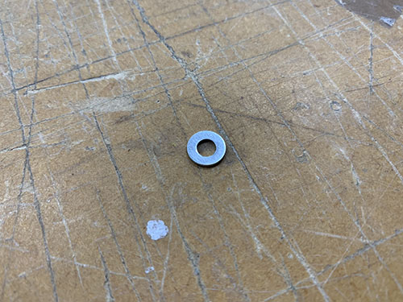               |

## Electronics

| Item No. | Type                                                              | Amount         | Image                                                                                          |
|----------|-------------------------------------------------------------------|----------------|------------------------------------------------------------------------------------------------|
| E01      | 12V Fan                                                           | 2              | 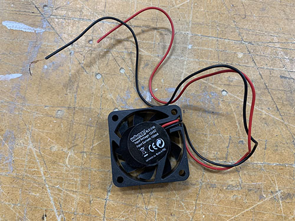                                                     |
| E02      | 12V power supply (UHP-200-12)                                     | 1              |                                    |
| E03      | 12V wires (black and red)                                         | ~10m           | 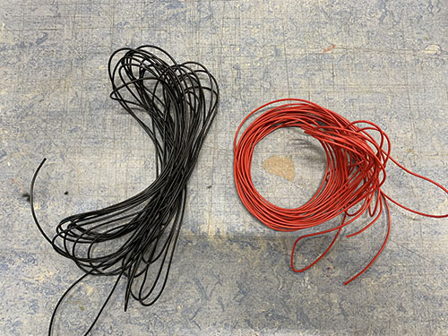                                         |
| E04      | 220V power plug                                                   | 1              | 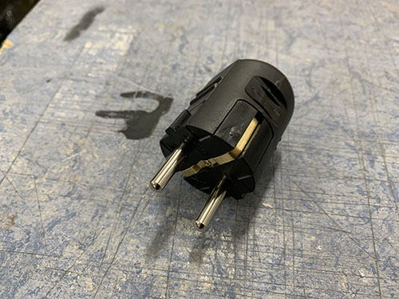                                       |
| E05      | 220V power socket                                                 | 1              |                                    |
| E06      | 220V/10A cable (red, blue and green/yellow)                       | ~2m            |                                        |
| E07      | 3-way Wago splicing connector (221-413)                           | 3              |  |
| E08      | AWG22 wire (red, blue, green and black)                           | ~10m per color |                                        |
| E09      | Arduino Uno                                                       | 1              | 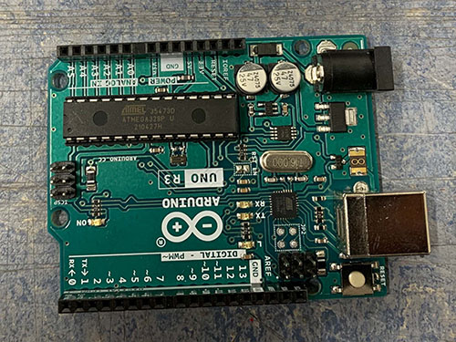                                     |
| E10      | Arduino Uno CNC Shield                                            | 1              | 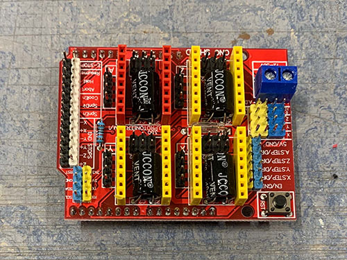                                       |
| E11      | Bipolar stepper motor (Nema 17, no gear, 5mm shaft diameter)      | 1              |                              |
| E12      | C-GRID III contact housing, 2.54mm (1X2)                          | 5              | Missing                                                                                        |
| E13      | C-GRID III contact housing, 2.54mm (1X4)                          | 4              | 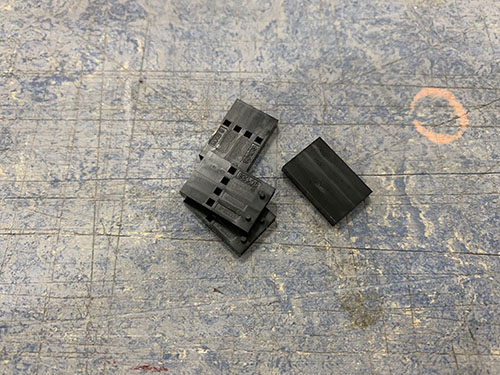                             |
| E14      | C14 terminal                                                      | 1              | 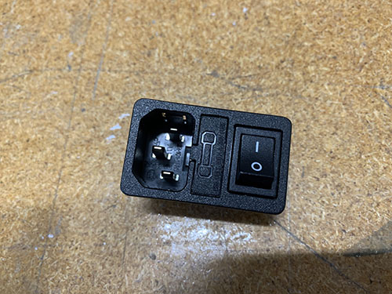                                   |
| E15      | Crimp sleeve C-GRID III AWG 22/24                                 | 26             |                                    |
| E16      | DRV8825 stepper drivers                                           | 4              |                              |
| E17      | Emergency stop switch (KJD17B)                                    | 1              | 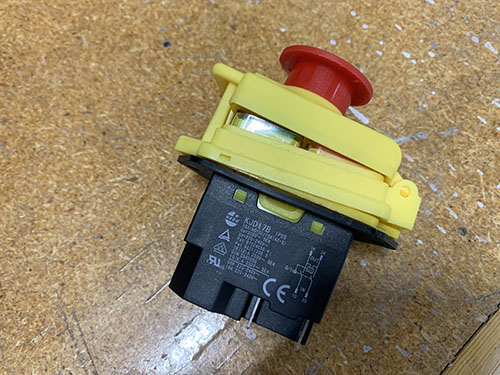                 |
| E18      | Geared (19:1) bipolar stepper motor (Nema 17, 8mm shaft diameter) | 3              |                                  |
| E19      | Jumpers                                                           | 6              | 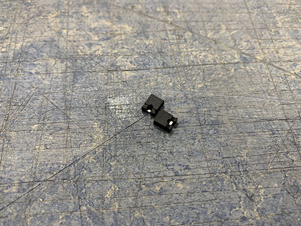                                             |
| E20      | Makita RT0700C (milling router)                                   | 1              |                                |
| E21      | Microswitch                                                       | 5              | 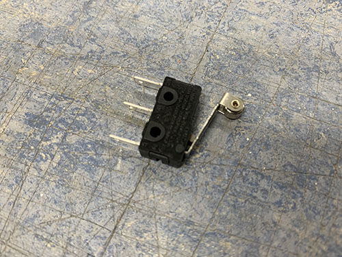                                     |
| E22      | Red LED                                                           | 1              | 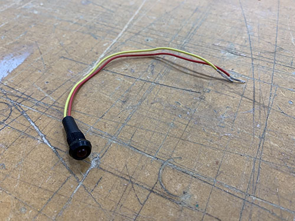                                             |
| E23      | Ring terminal (M3)                                                | 4              |                            |
| E24      | Ring terminal (M4)                                                | 3              |                            |
| E25      | Spade connector (2.8mm)                                           | 10             |                  |
| E26      | Spade connector (4.8mm)                                           | 6              |                  |
| E27      | Spade connector (6.3mm)                                           | 4              |                  |
| E28      | USB A (male) to USB B (male)                                      | 1              |                                |
| E29      | USB A PCB (female)                                                | 1              | 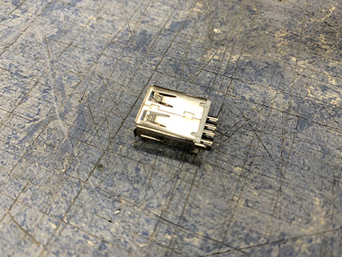                                   |
| E30      | C13 cable                                                         | 1              | 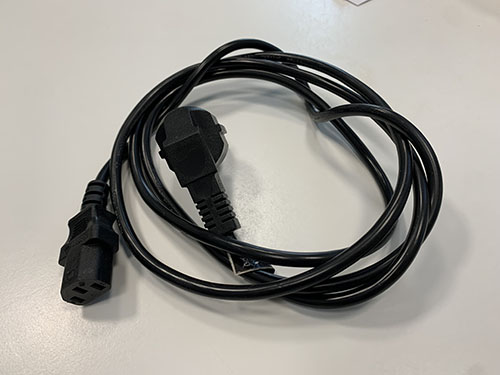                                         |

## Threaded rods

| Item No. | Size | Length | Amount | Image                                                                      |
|----------|------|--------|--------|----------------------------------------------------------------------------|
| T01      | M5   | 140mm  | 2      |  |
| T02      | M8   | 120mm  | 8      |  |
| T03      | M8   | 717mm  | 4      |  |

## Other

|     | Type                                               | Amount | Image                                                                                              |
|-----|----------------------------------------------------|--------|----------------------------------------------------------------------------------------------------|
| O01 | 698zz bearing                                      | 18     |                                            |
| O02 | Acme threaded rod (300 mm long, 8x8mm)             | 1      |                                    |
| O03 | Acme threaded rod nut (8x8mm)                      | 1      |                                                      |
| O04 | Aluminium profiles (677x30x30 mm)                  | 4      |  |
| O05 | Aluminium profiles (803x30x30 mm)                  | 3      |  |
| O06 | Aluminium profiles (80x30x30 mm)                   | 8      | 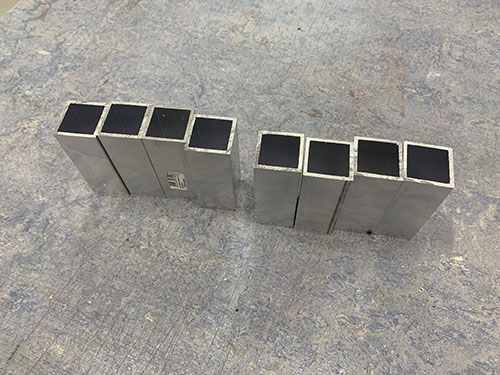   |
| O07 | Aluminium profiles (900x30x30 mm)                  | 4      |  |
| O08 | Braided cable sleeve (20mm)                        | 5m     |                                              |
| O09 | Cable chain (1m long, 30x15mm inner dimensions)    | 2      |                                                |
| O10 | Cable clip                                         | 1      | 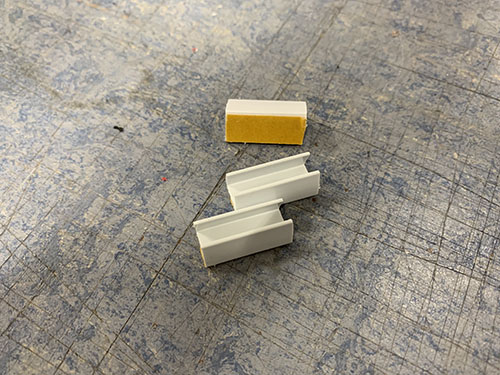                                                 |
| O11 | Cable ties                                         | ~30    | 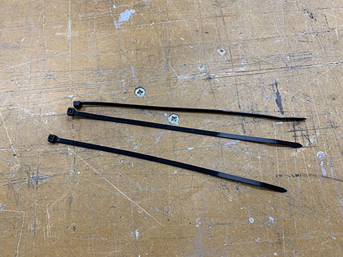                                                 |
| O12 | Flat end mill                                      | NA     | 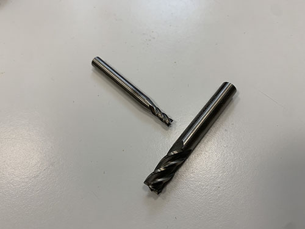                                         |
| O13 | Flexible conduit                                   | 2m     | 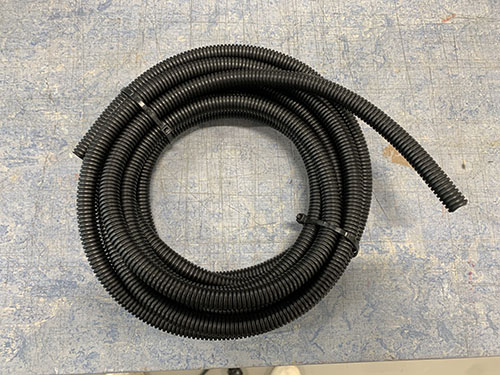                                           |
| O14 | GT2 belt (6mm belt width, 300mm long)              | 1      |                                        |
| O15 | GT2 pulley (16 teeth, 5mm bore, 6mm belt width)    | 1      |                                |
| O16 | GT2 pulley (60 teeth, 8mm bore, 6mm belt width)    | 1      | 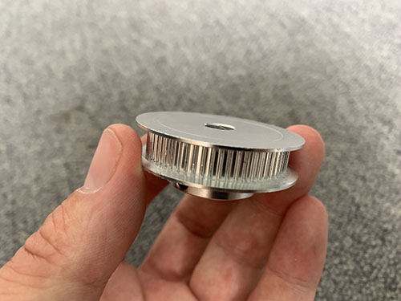                               |
| O17 | HTD5M belt (15mm width)                            | 4m     |                                                  |
| O18 | HTD5M pulley (12 teeth, 8mm bore, 15mm belt width) | 3      |                                              |
| O19 | KFL08 rod bearing (8mm)                            | 2      |                                    |
| O20 | MGN12H linear rail (200mm)                         | 2      | 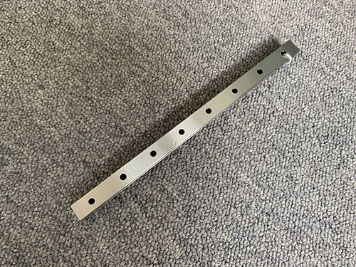                                 |
| O21 | MGN12H linear rail (600mm)                         | 4      |                                  |
| O22 | MGN12H linear rail block                           | 12     | 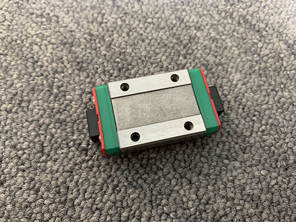                                   |
| O23 | Masking tape                                       | 1      |                                              |
| O24 | Shrinking tubes                                    | NA     |                                        |
| O25 | Cable grommet                                      | 1      |                                            |
| O26 | Plywood (approx. 12x1500x1500mm)                   | 1      |                                                        |
| O27 | Brush                                              | 0.5m   |                                                    |