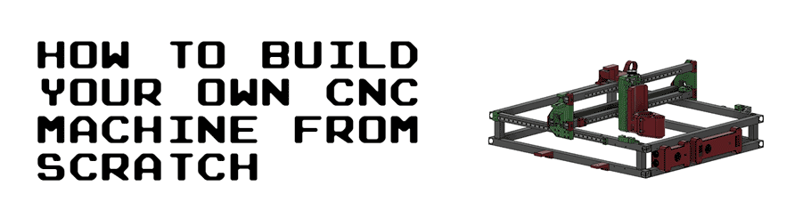

This guide goes through all the steps to build your own CNC machine from scratch. It includes a complete bill of materials (BOM), STL/OBJ-files for all the 3d-printed parts and detailed instructions of how everything is assembled. It also includes instructions of how all the necessary open-source softwares are installed.

The guide is based on Ivan Miranada's design and is a complement to Ivan's Youtube-videos:

1. Original video: [https://www.youtube.com/watch?v=_atw3e0nIrg](https://www.youtube.com/watch?v=_atw3e0nIrg)
2. Updates with geared stepper motors etc: [https://www.youtube.com/watch?v=qpjf5D3WngY](https://www.youtube.com/watch?v=qpjf5D3WngY)
3. Updating to metal parts: [https://www.youtube.com/watch?v=RDnGvhdGFEY](https://www.youtube.com/watch?v=RDnGvhdGFEY)

If you have any questions, feel free to contact me on LinkedIn: [https://www.linkedin.com/in/max-fischer-92997281/](https://www.linkedin.com/in/max-fischer-92997281/) 

or


---

**Featured on**

* Hackernews (#2): [https://news.ycombinator.com/item?id=29096954](https://news.ycombinator.com/item?id=29096954)
* Console open-source newsletter: [https://console.substack.com/p/console-83](https://console.substack.com/p/console-83)
* Hackaday's blog: [https://hackaday.com/2021/11/05/diy-cnc-uses-lots-of-3d-printed-parts/](https://hackaday.com/2021/11/05/diy-cnc-uses-lots-of-3d-printed-parts/)
* Hackaday's podcast (~25:30): [https://open.spotify.com/episode/2YuxrVAgbQvVTjcUljJ3rj?si=lkp1L061R7ix6WkA7s1ieA](https://open.spotify.com/episode/2YuxrVAgbQvVTjcUljJ3rj?si=lkp1L061R7ix6WkA7s1ieA)
* Arduino's official blog: [https://blog.arduino.cc/2021/11/03/learn-how-to-build-your-own-massive-3d-printed-cnc-router/](https://blog.arduino.cc/2021/11/03/learn-how-to-build-your-own-massive-3d-printed-cnc-router/)
* Weekly robotics newsletter: [https://weeklyrobotics.com/weekly-robotics-168](https://weeklyrobotics.com/weekly-robotics-168)

---

# Table of content
1. [License](#license)
2. [Parts (bill of materials)](#parts-bill-of-materials)
3. [Build the CNC machine](#build-the-CNC-machine)
	1. [Main frame](#main-frame)
		1. [Drill holes in 900 mm profiles](#drill-holes-in-900-mm-profiles)
		2. [Rails to 900 mm profiles](#rails-to-900-mm-profiles)
		3. [Assemble upper and lower frames](#assemble-upper-and-lower-frames)
		4. [Interlock upper and lower frames](#interlock-upper-and-lower-frames)
	2. [Y-axis](#y-axis)
		1. [Side plates to upper frame](#side-plates-to-upper-frame)
		2. [Y-axis motors, idlers and pulleys to side plates](#y-axis-motors-idlers-and-pulleys-to-side-plates)
		3. [Y-axis belt tensioners and end-stop mounts](#y-axis-belt-tensioners-and-end-stop-mounts)
		4. [Y-axis HTD5M belts](#y-axis-htd5m-belts)
	3. [X-axis and Z-axis](#x-axis-and-z-axis)
		1. [Rails to bridge beams](#rails-to-bridge-beams)
		2. [X-axis tensioner and end-stop mount to lower bridge beam](#x-axis-tensioner-and-end-stop-mount-to-lower-bridge-beam)
		3. [Bridge beams to side plates](#bridge-beams-to-side-plates)
		4. [Rod bearings to carriage](#rod-bearings-to-carriage)
		5. [Carriage to bridge beams](#carriage-to-bridge-beams)
		6. [X-axis motor, idlers and pulley to carriage](#x-axis-motor-idlers-and-pulley-to-carriage)
		7. [X-axis HTD5M belt](#x-axis-htd5m-belt)
		8. [Acme nut and rails to carriage slider](#acme-nut-and-rails-to-carriage-slider)
		9. [Acme rod and vertical slider to carriage](#acme-rod-and-vertical-slider-to-carriage)
		10. [Z motor mount and X-axis cable chain](#z-motor-mount-and-X-axis-cable-chain)
		11. [Y-axis cable chain](#y-axis-cable-chain)
		12. [Z stepper motor, pulleys and belt](#z-stepper-motor-pulleys-and-belt)
	4. [Stepper motors and end-stops](#stepper-motors-and-end-stops)
		1. [Extend stepper motor wires](#extend-stepper-motor-wires)
			1. [Y-axis 1](#y-axis-1)
			2. [Y-axis 2](#y-axis-2)
			3. [X-axis](#x-axis)
			4. [Z-axis](#z-axis)
		2. [End-stops and end-stop wires](#end-stops-and-end-stop-wires)
			1. [X-axis (max)](#x-axis-max)
			2. [X-axis (min)](#x-axis-min)
			3. [Y-axis (max)](#y-axis-max)
			4. [Y-axis (min)](#y-axis-min)
			5. [Z-axis (max)](#z-axis-max)
		3. [Stepper motor and end-stop cable management](#stepper-motor-and-end-stop-cable-management)
			1. [Y-axis steppers and X-axis end-stops](#y-axis-steppers-and-x-axis-end-stops)
			2. [X-axis stepper, Z-axis stepper and Z-axis end-stop](#x-axis-stepper-Z-axis-stepper-and-z-axis-end-stop)
	5. [Router](#router)
		1. [Attach router to carriage](#attach-router-to-carriage)
		2. [Router cable management](#router-cable-management)
	6. [Electronic boxes](#electronic-boxes)
		1. [Small electronic box](#small-electronic-box)
		2. [Large electronic box](#large-electronic-box)
	7. [Electrical wiring and connect components](#electrical-wiring-and-connect-components)
		1. [Main power supply](#main-power-supply)
		2. [Prepare power to steppers and connect fans and LED](#prepare-power-to-steppers-and-connect-fans-and-LED)
		3. [Assemble stepper motor drivers and tune VRef](#assemble-stepper-motor-drivers-and-tune-vref)
		4. [Attach Arduino and solder USB cable](#attach-arduino-and-solder-usb-cable)
		5. [Stepper and end-stop cable management to small electronic box](#stepper-and-end-stop-cable-management-to-small-electronic-box)
		6. [Connect steppers to CNC shield](#connect-steppers-to-cnc-shield)
		7. [Connect end-stops to CNC shield](#connect-end-stops-to-cnc-shield)
		8. [Set microstepping](#set-microstepping)
		9. [Router cable management and connect to main power supply](#router-cable-management-and-connect-to-main-power-supply)
		10. [Final test of electrical wiring](#final-test-of-electrical-wiring)
	8. [Wasteboard](#wasteboard)
		1. [Cut out wasteboard](#cut-out-wasteboard)
		2. [Attach wasteboard to CNC](#attach-wasteboard-to-cnc)
	9. [Dust shoe (updated Feb 4, 2022)](#dust-shoe-updated-feb-4-2022)
4. [Software](#software)
	1. [Install CNC software (grbl) on Arduino Uno](#install-cnc-software-grbl-on-arduino-uno)
		1. [Install Arduino Software (IDE)](#install-arduino-software-ide)
		2. [Install GRBL](#install-grbl)
	2. [G-Code sender](#g-code-sender)
		1. [Install G-Code sender](#install-g-code-sender)
		2. [Connect G-Code sender to GRBL](#connect-g-code-sender-to-grbl)
		3. [Adjust GRBL configuration](#adjust-grbl-configuration)
			1. [Enable end-stops/hard limits](#enable-end-stopshard-limits)
			2. [Calculate and set travel resolutions](#calculate-and-set-travel-resolutions)
			3. [Other configurations](#other-configurations)
5. [Final notes](#final-notes)

# License
The following license is included when buying Ivan Miranda's blueprints of the CNC machine:

```
Everything that is in these files that I produced myself, apart from reselling the files, is allowed.
You can print and sell parts, sell machines, sell courses to build the machine. Modify the parts and post 
them for free, as long as you don’t sell the files and keep this license on everything you make with the 
files and credit me, we’re good. No DRM or anything, you are even allowed to repost the files as long as 
they’re kept free. Why buy this then? To support me and keep me encouraged to do more projects like this. 
```

Ivan does an amazing job putting these DIY builds together. I've posted his STL-files in this repository to simplify the build, but PLEASE buy his blueprints here: [https://ivanmiranda.com/products/3d-printed-cnc](https://ivanmiranda.com/products/3d-printed-cnc). It's only \$25 and helps him to continue build and share his awesome projects. Also, you will get access to a Discord channel that is really useful, where you can ask questions to a lot of people who have already built the machine.

Also, the Z-axis end-stop trigger, the ordinary end-stops and the rail supports all come from cello4's GitHub: [https://github.com/4cello/mirandacnc-community](https://github.com/4cello/mirandacnc-community).

# Parts (bill of materials)

**CLICK HERE TO OPEN THE BILL OF MATERIALS (BOM) MARKDOWN: [Bill of materials](./BILLOFMATERIAL.md)**

To simplify the build, I've created a separate markdown page with tables covering all parts needed to build the CNC-machine. The tables include a unique `Item No.` to easier refer to the parts in the guide. The tables also include images of all parts and .STL/.OBJ files of the parts that needs to be 3d-printed.

To get an even better understanding of how all the parts are used, I've created a detailed spreadsheet with comments:

* [On Google drive](https://docs.google.com/spreadsheets/d/1VdnPilA22OfAh9a1y4Ft6c2xkio206Dzv85h7AX7CmQ/edit?usp=sharing)
* [Bill\_of\_material.xlsx](./Bill_of_material.xlsx)

**To be able to continue with the build, you need to buy and 3d-print all needed parts found in the [bill of materials](./BILLOFMATERIAL.md).**

# Build the CNC machine
This section covers how all the parts is put together to build the CNC machine. 

All the measurements, distances and a complete overview of how everything comes together can be found in the main Fusion 360 CAD design. It can be downloaded here:

* [fusion\_360\_cad\_files.f3z](./fusion_360_cad_files.f3z)

Please note that the main Fusion 360 design is quite messy, which is one of the reasons why I've extracted the needed parts in a separate bill of materials.

Fusion 360 is a CAD program developed by Autodesk. It's free for personal use and can be downloaded here: [https://www.autodesk.com/products/fusion-360/personal](https://www.autodesk.com/products/fusion-360/personal). After you've downloaded Fusion 360, import `fusion_360_cad_files.f3z` to load the main CAD design. This can also come in handy if you need to adjust some of the 3d-printed parts.

## Main frame

### Drill holes in 900 mm profiles
The main frame consists of two separate frames, the lower and the upper frame. The two frames are kept together using threaded rods, washers and nuts. To enable the threaded rods to slide through the aluminium profiles, holes needed to be drilled.

First, a sharpie was used to indicate where all the holes were going in the 900mm profiles (**O07**). This was done by using a set square and a penn. A bradawl and a hammer were then used to make indentations at the center of the holes.

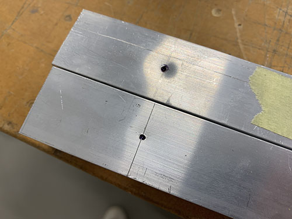

A 9 mm drill-bit and a bench drill was used to drill the holes straight through the profiles.

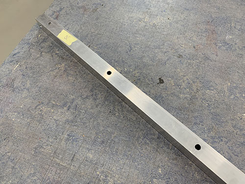

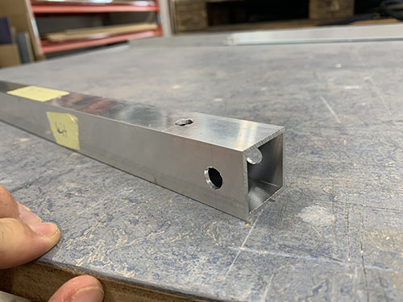

To be able to access the nuts and tight them with a socket wrench, some holes (facing outwards, see Fusion360 CAD file) needed to be enlarged. A sharpie was used to mark all the holes that needed to be enlarged.

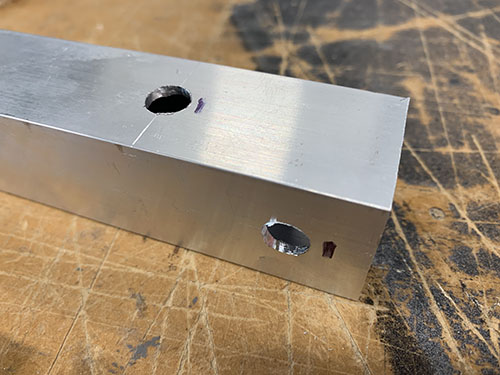

A step drill was then used to enlarge the holes holes to 20 mm. A tip is to measure the size of your socket wrench and keep the holes as small as possible, while you're still able to tighten the nuts. To be able to see which step you're aiming for on the step drill, attach a small piece of masking tape on the step above.

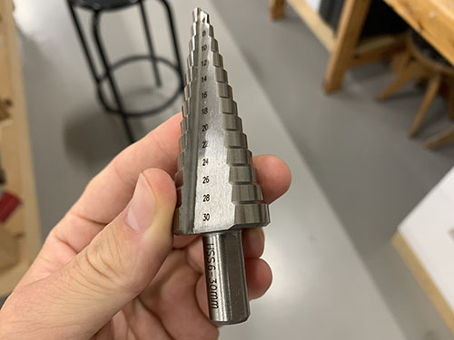

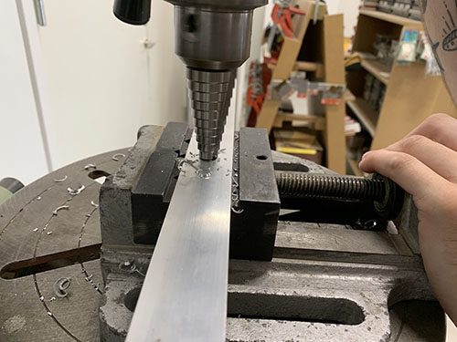

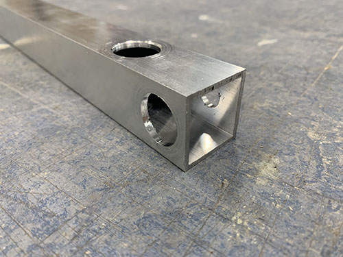

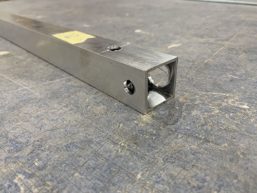

The edges were finally smoothed out using a round metal file.

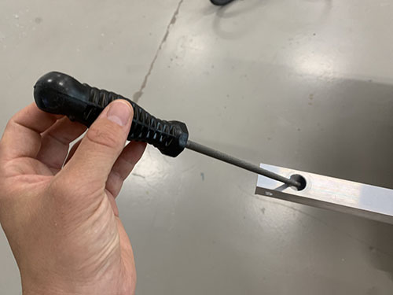

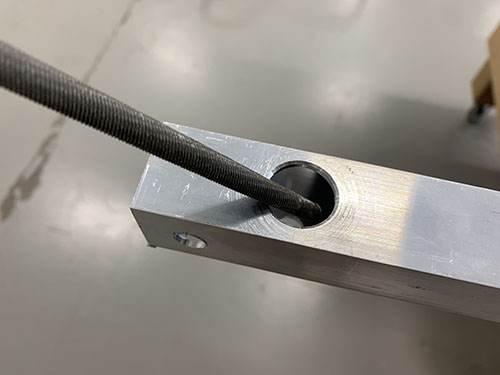

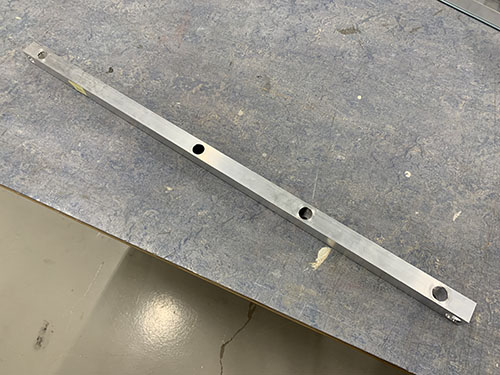

### Rails to 900 mm profiles

Before the upper and lower frames were assembled, two 600 mm MGN12H rails (**O21**) were attached to the 900 mm aluminium profiles (**O07**) of the **upper** frame. They were attached to the sides facing outwards and above the three 80 mm vertical beams (connecting the lower and upper frame). A tip is to place all the profiles as they should go to make sure that you're attaching the rails to the correct faces (see the red boxes on the image below). Also, be very careful when removing the MGN12H blocks (**O22**) from the rails.

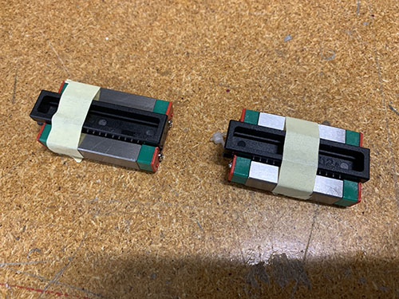

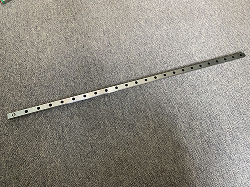

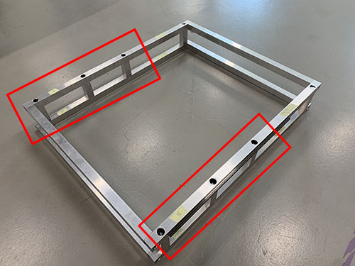

3x 3d-printed support tools (**P25**) were used to center the rails on the profiles. A 57 mm wood block were cut out and used to attach the rails at the same distance from the end of the profiles on both sides. The rails were then clamped to the profiles.


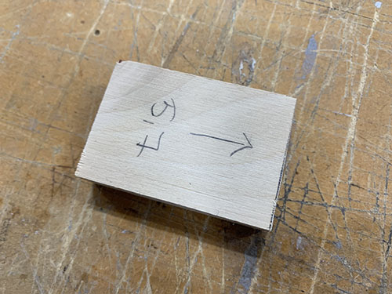

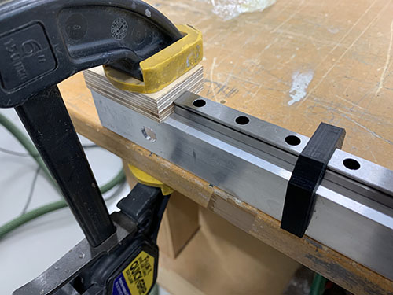

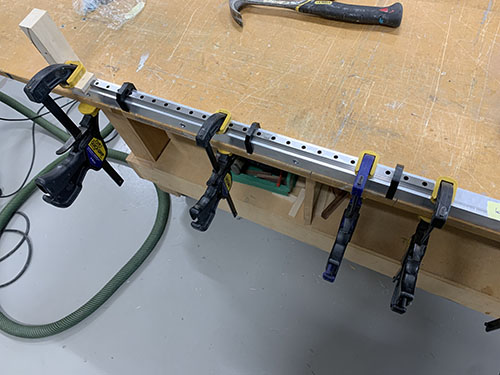

A bradawl and a hammer were then used to make indentations at the center of the holes. Cutting fluid was applied and a 2 mm drill was used to drill all the holes.

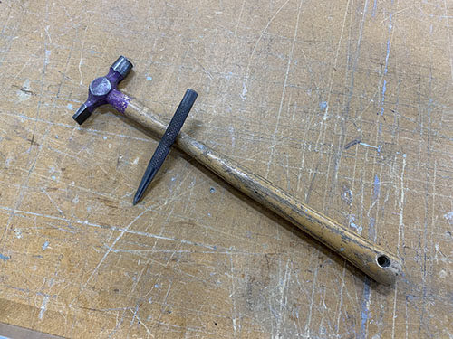

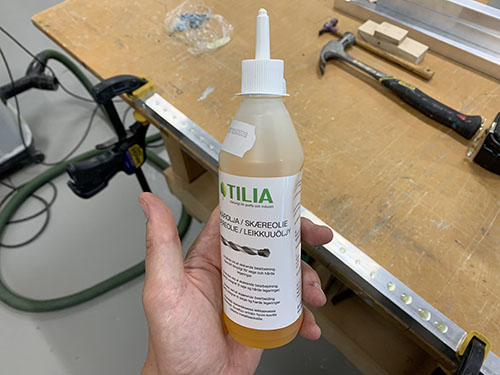

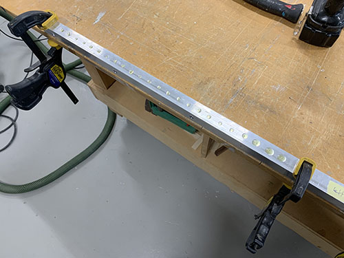

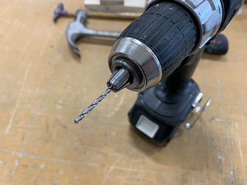

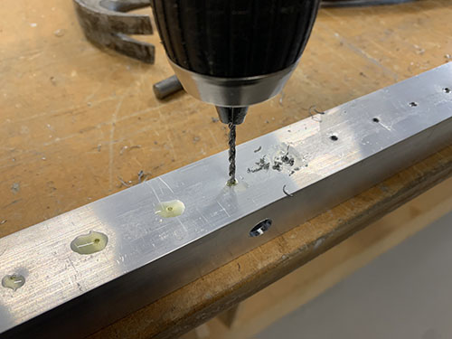

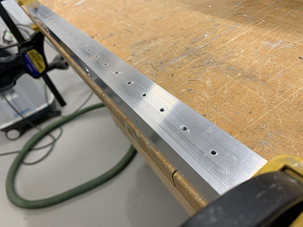

Cutting fluid was then applied once more on the drilled holes and a M3 drill tap was used to create threads in the holes.

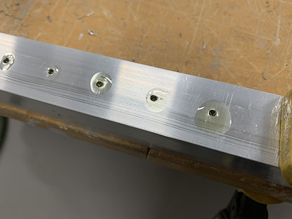

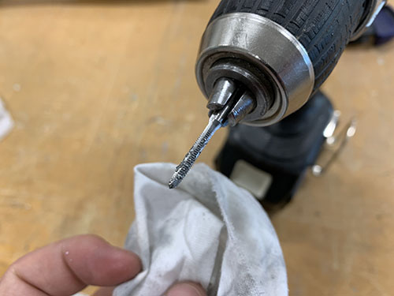

Finally, the rails were attached using 48x 16 mm M3 screws (**S03**).

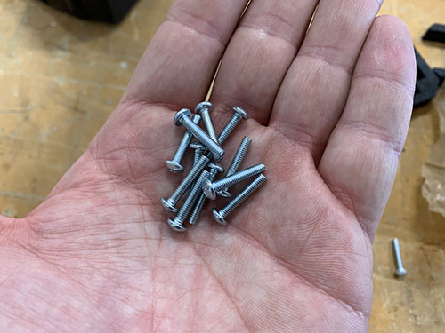

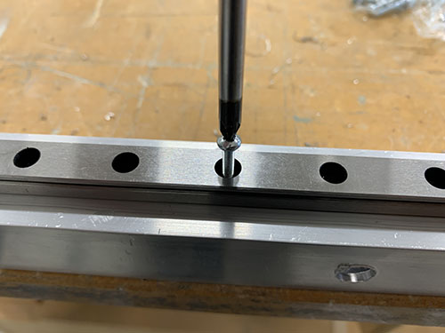

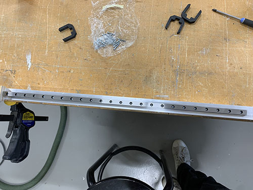

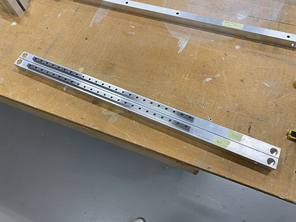

### Assemble upper and lower frames

The two frames were assembled using the 4x 717 mm M8 threaded rods (**T03**), 8x (20mm, 10mm, 2mm) washers (**W04**) and 8x M8 lock nuts (**N03**).

The profiles were first placed in their correct place and clamps were used to keep the profiles aligned. I used two jointed spanners (one one each side) to lock everything in place, but you can also use two socket wrenches. Just make sure that the bits fit into the drilled holes.

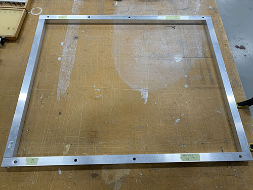

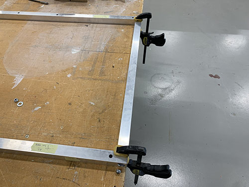

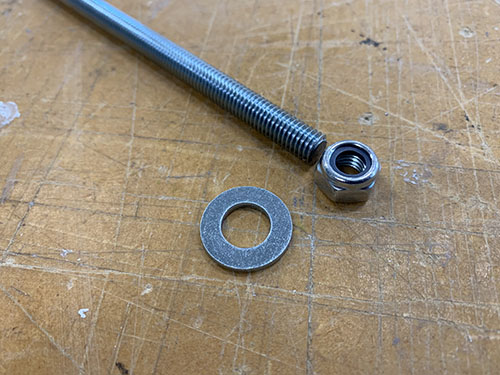

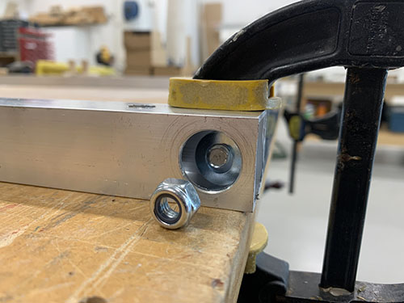

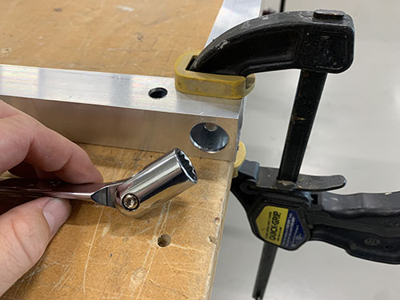

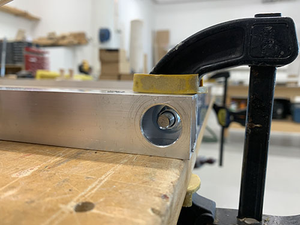

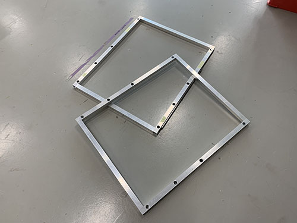

### Interlock upper and lower frames

The upper and lower frames and the 8x 80 mm vertical aluminium beams (**O06**) were first layed out in their correct place. The 803 mm horizontal bridge beams (used later in the tutorial) (**O05**) and clamps were then used to align the frames on top of each other.

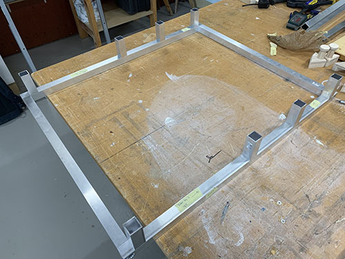

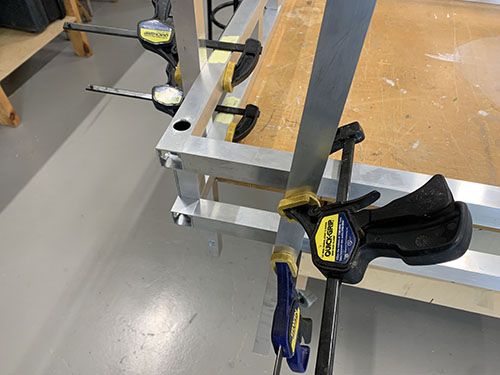

8x 120 mm M8 threaded rods (**T02**), 16x (20mm, 10mm, 2mm) washers (**W04**) and 16x M8 lock nuts (**N03**) were then used to interlock the upper and lower frames, with the 80 mm vertical aluminium profiles in between.

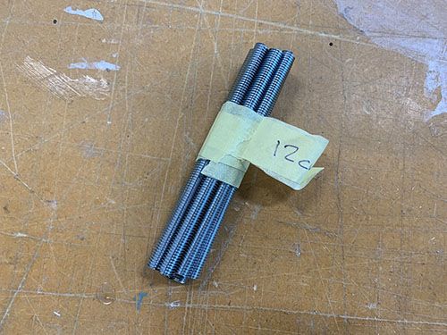

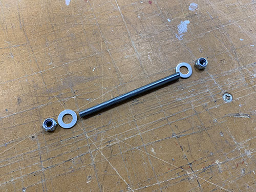

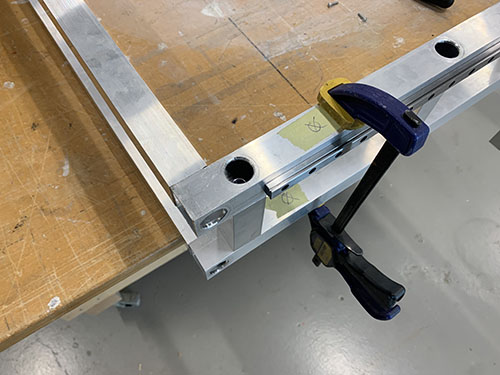


## Y-axis

### Side plates to upper frame

Before attaching the side plates, the MGN12H blocks (**O22**) were added back onto the rails, 2x on each side. Be careful when sliding them onto the rails, there are multiple small bearing balls that easily fall out of the blocks.

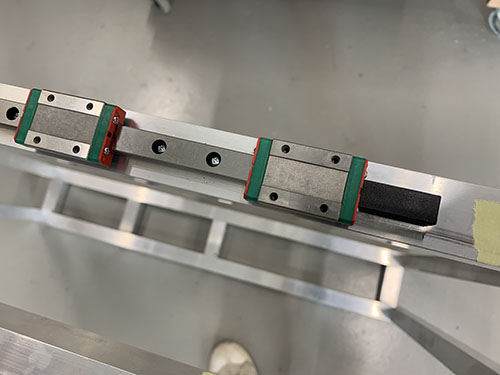

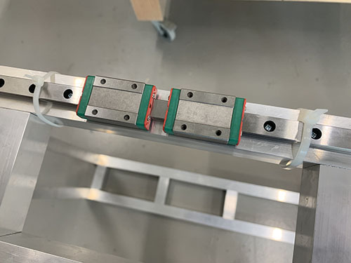

The left (**P20**) and right (**P29**) side plates where then attached to the blocks using 16x 20 mm M3 screws (**S04**) (8x on each side plate). Make sure to attach the plates on the correct side (see images below).

I had to redesign the left side plate and reprint it later in the build (after the images were taken). Therefore, the left side plate seen in the upcoming images look a bit different than the one used (see next image for the left side plate used).

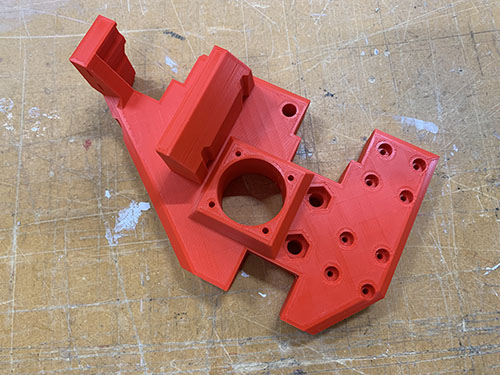

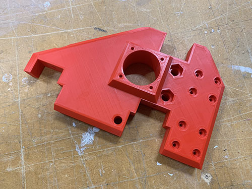

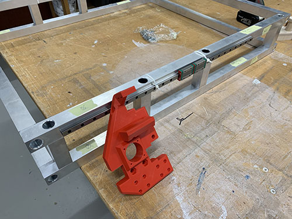

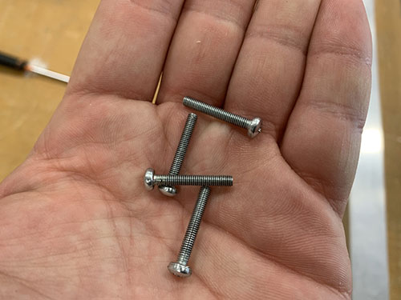

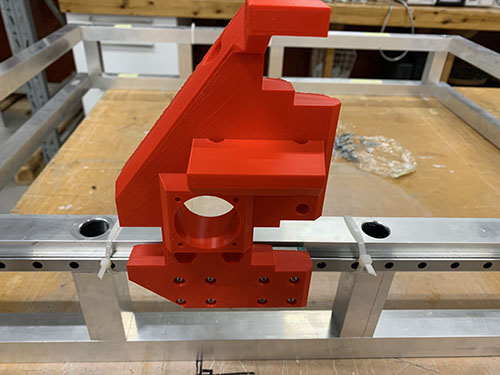

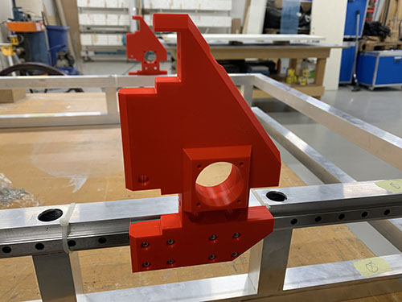

### Y-axis motors, idlers and pulleys to side plates

Each idler were made up out of 1x idler blocker (**P16**), 2x 60 mm fully threaded M8 screws (**S15**), 6x 698zz bearings (**O01**) and 8x (15 mm x 8.5 mm x 1.5mm) washers (**W03**) (2x closest to the idler blocker and 6x closest to the side plate). The idlers were then attached to each side plate using two M8 nuts (**N03**). Make sure that the bearings are spinning freely.


As I designed and added the idler blocker later on in the build, some of the images doesn't have it and they also have 3x washers instead of 1x washer closest to the screw head. I left these images anyways in the guide so you can see how it looks when you attach the idlers, but please ignore the wrong number of washers. Also ignore all the other things around the idlers in the upcoming 2 images, they are taken later on in the build.


Should be idler blockers and a different number of washers in the upcoming images.


To attach the stepper motors to the side plates, the 4x M3 screws (**S07**) locking the gear box to the motor were removed. Save these as they will be used later on to attach the power supply and Arduino to the electronic boxes.


The 2x geared stepper motors (**E18**) were then inserted into the large holes on the side plates, facing inwards. 4x 40 mm M3 screws (**S06**) and 4x M3 washers (**W05**) were used to lock each stepper motor to the side plates (I forgot to add the washers in the images below, therefore they're not visible). The motors should be attached so that the cables are facing in the direction of the two bridge beams (i.e. the longer vertical surface on the side plates).


1x HTD5M timing pulley (**O18**) was attached to each motor shaft using set screws.


### Y-axis belt tensioners and end-stop mounts

2x fixed belt tensioners (**P19**, **P28**) were attached to the longer aluminium profiles of the upper frame using 4x 20mm M5 screws (**S12**) (2x for each fixed belt tensioner). When aligning the fixed belt tensioners, make sure that the "belt opening" is pointing in the direction of the rails (1x fixed belt tensioner for each rail). Also make sure that the fixed belt tensioners are positioned on the correct side of the rail (see images). Similar to before, a bradawl and a hammer were used to make indentations at the center of the holes. Cutting fluid was applied and a 4 mm drill was used to drill the holes, followed by a M5 drill tap.


2x belt tension sliders (**P17**, **P26**) were attached on the opposite side of the fixed belt tensioners, ontop of the aluminium profile, using 4x 20mm M5 screws (**S12**). To get them aligned at the exact same place on both sides, a 100 mm distance was cut out and a flat support was clamped to the inner side of the profile. The same drill and tap size were used as for the fixed belt tensioners (4mm drill, M5 drill tap). Make sure that the belt tension sliders are pointing outwards.


2x end-stop mounts (**P08**) were then attached to the same side as the belt tension sliders using 4x 20mm M5 screws (**S12**), facing outwards and aligned with the rails. The same drill and tap size were used as for the fixed belt tensioners (4mm drill, M5 drill tap).


The belt tensioners (**P18**, **P27**) were loosely attached to the belt tension sliders using 2x 60 mm fully threaded M8 screws (**S15**), 2x M8 nuts(**N03**) and 2x (20mm x 10mm x 2mm) washers (**W04**).


### Y-axis HTD5M belts

The HTD5M belt (**O17**) was first inserted into one of the fixed belt tensioners using a flat screw driver. It was then stretched along the aluminium profile, below the first idler, around the timing pulley, below the second idler and all the way to the belt tensioner.


A scissor was used to cut the belt at an appropriate length. The loose end was then inserted into the belt tensioner using a flat screw driver and the belt was stretched by tightning the M8 nut.


Make sure that the belt is not too loose and not too tight.


Repeat on the other side.

## X-axis and Z-axis

### Rails to bridge beams

The last two 600 mm MGN12H rails (**O21**) were attached to two of the 803 mm aluminium bridge beams (**O05**, used for the X-axis). First, the MGN12H blocks (**O22**) were carefully removed from the rails.


The same 100 mm distance used to align the belt tension sliders were used to align the rails. Because they will be off center by 3 mm, make sure that you later attach the bridge beams to the side plates in a way so the rails line up. 

The same 3d-printed support tools (**P25**) used to align the rails on the 900 mm aluminium profiles were used here as well. Everything was clamped into position. A bradawl and a hammer were used to make indentations and a 2 mm drill and a M3 drill tap was used to make the screw holes.


The rails were finally attached using 16 mm M3 screws (**S03**) and the MGN12H  rail blocks (**O22**) were gently slided back onto the rails.


### X-axis tensioner and end-stop mount to lower bridge beam

The fixed tensioner (**P28**) and end-stop mount (**P08**) were attached to the lower bridge beam in the same fashion as on the 900 mm aluminium profiles, using 4x 20mm M5 screws (**S12**). When aligning the fixed tensioner, make sure that the "belt opening" is pointing in the direction of the rail. A bradawl and a hammer were used to make indentations at the center of the holes. Cutting fluid was applied and a 4 mm drill was used to drill the holes, followed by a M5 drill tap.


### Bridge beams to side plates

All three bridge beams (**O05**) were then inserted into the slots on the side plates. Make sure that the two beams with the rails are on top of each other, with the rails pointing outwards. Also, make sure that you insert them in the correct orientation, so that the rails are lined up (due to the rails being 3 mm off center).


When the bridge beams were aligned, the blocker clips (**P21**, **P22**, **P23**, **P30**, **P31**, **P32**) were placed in their correct place and a sharpie was used to mark the center of the holes to be drilled. Similar to before, a bradawl and a hammer were used to make indentations at the center of the holes.


A 7 mm drill bit was used to drill the holes. As these holes were going straight through the profiles, a bench drill was used for precision. A metal file was used to remove all excess metal around the holes.


The bridge beams were then inserted into the slots on the side plates once more, along with all the blocker clips. 2x 140 mm threaded M5 rod (**T01**) was inserted through the bottom two beams and 2x 60 mm M5 (**S14**) screws was inserted through the top bridge beam. It was all tightened using M5 nuts (**N02**).


### Rod bearings to carriage

Before attaching the carriage (**P07**) to the bridge beams, two KFL08 rod bearings (**O19**) were attached on the top and the bottom of the carriage (inside) using 4x 20 mm M5 screws (**S12**) and 4x M5 nuts (**N02**). A tip is to temporarily use the acme rod (used in an upcoming step) to vertically align the two bearings.


### Carriage to bridge beams

The carriage was attached to the 4x MGN12H blocks (**O22**) on the bridge beams, using 16x 25 mm M3 screws (**S05**).


### X-axis motor, idlers and pulley to carriage

Each idler were made up out of 1x 60 mm fully threaded M8 screw (**S15**), 3x 698zz bearings (**O01**) and 4x (15 mm x 8.5 mm x 1.5mm) washers (**W03**) (1 closest to the idler blocker and 3 closest to the side plate). 2x idlers were then attached to each side plate using 2x M8 nuts (**N03**). Make sure that the bearings are spinning freely.


As I designed and added the idler blocker later on in the build, some of the images doesn't have it and they also have 3 washers instead of 1 washer closest to the screw head. I left these images anyways in the guide so you can see how it looks when you attach the idlers, but please ignore the wrong number of washers. Also ignore all the other things around the idlers in the upcoming image, they are taken later on in the build.


Should be idler blockers and a different number of washers in the upcoming images.


To attach the stepper motor to the carriage, the 4x M3 screws locking the gear box to the motor were removed.


The stepper motor was then inserted into the large hole on the carriage, facing towards the bridge beams/idlers. 4x 40 mm M3 screws (**S06**) and 4x M3 washers (**W05**) were used to lock the stepper motor onto the carriage. The motor should be attached so that the cables are facing upwards.


1x HTD5M timing pulley (**O18**) was attached to the motor shaft using set screws.


### X-axis HTD5M belt

The HTD5M belt (**O17**) was first inserted into the fixed belt tensioner using a flat screw driver. It was then stretched along the aluminium profile, below the first idler, around the timing pulley, below the second idler and all the way to the other side.

The belt was cut at an appropriate length and inserted into the belt tensioner (**P27**) using a flat screw driver.


The belt tensioner was then attached to the side plate using 1x 60mm fully threaded M8 screw (**S15**), 1x M8 nut (**N03**) and 1x (20mm x 10mm x 2mm) washer (**W04**). The M8 screw in the image is not fully threaded as I lost the one I was suppose to use and had to use another one, so please ignore :)


Make sure that the belt is not too loose and not too tight.


### Acme nut and rails to carriage slider

1x acme nut (**O03**) was inserted from the outside, into the the center hole at the top of the vertical carriage slider (**P36**). It was locked in place using 4x 25mm M3 screws (**S05**).


2x smaller 200 mm MGN12H rails (**O20**) were then attached to the back of the vertical carriage slider. First, the MGN12H blocks (**O22**) were carefully removed from each rail. After that, the rails were screwed in place on the back of the vertical carriage slider using 16x 20 mm M3 screws (**S04**). The MGN12H blocks were then slided back on and each end were blocked using tape. 


### Acme rod and vertical slider to carriage

To attach the vertical slider to the carriage, 16x 25 mm M3 screws (**S05**) were first inserted into the holes on the carriage. You might need to "open up" the holes using a narrow tool (depending on the direction you 3d-printed the carriage).


1x acme rod (**O02**) was then inserted through the two KFL08 rod bearings and the acme nut, and the set screws on the bearings were tightened.


The vertical slider was finally attached to the carriage by attaching the previously mentioned 16x 25 mm M3 screws (**S05**) to the MGN12H blocks on the vertical slider.


### Z motor mount and X-axis cable chain

The first step was to find a good length of the X-axis cable chain (**O09**). To simplify this process, the X-axis belt was removed to easier move the carriage along the X-axis.


The Z motor mount (**P40**) and the X-axis cable chain mount (**P38**) were then attached using 3x 25 mm M4 screws (**S10**), 3x M4 nuts (**N01**) and 3x (10mm x 5mm x 1mm) washers (**W01**).


They Z motor mount was then attached to the carriage using 2x 80mm M8 screws (**S16**), 2x M8 nuts (**N03**) and 1x (20mm x 10mm x 2mm) washers (**W04**). The vaccum mount was also inserted and attached to the right-side M8 screw. Please ignore the timing pulley attached to the acme rod in some of the images, it will be attached in a later step.


1x 1 meter cable chain (**O09**) were then clamped to the cable chain mount and to the back-side bridge beam. The carriage was then moved as far to the sides as possible. It's important that the chain doesn't touch any of the side plates when moved. In my case, I had to remove 3 links from the cable chain to get a good length of the chain.


The Z motor mount and cable chain mount were then disassembled and the cable chain was properly attached to the cable chain mount using 2x 25mm M4 screws (**S10**), 2x M4 nuts (**N01**) and 2x (10mm x 5mm x 1mm) washers (**W01**).


The Z motor mount and cable chain mount were then assembled again and attached to the carriage in the same fashion as before.


The carriage was move all the way to the right side plate and the cable chain was clamped to the lower back bridge beam.


A bradawl and a hammer were used to make indentations at the center of the two holes. Cutting fluid was applied and a 3 mm drill was used to drill the holes, followed by a M4 drill tap. The cable chain was then attached to the bridge beam using 2x 25 mm M4 screws (**S10**).


Finally, the X-axis belt was reattached and tightened.


### Y-axis cable chain

The Y-axis cable chain (**O09**) was attached to the frame using 1x cable chain mount (**P05**) and 1x cable chain support (**P06**). The cable chain mount was clamped to the left side of the lower frame and aligned with the last vertial beam. A bradawl and a hammer were used to make indentations at the center of the two holes. Cutting fluid was applied and a 4 mm drill was used to drill the holes, followed by a M5 drill tap. The cable chain mount was then attached to the lower frame using 2x 20 mm M5 screws (**S12**).


The cable chain support was only attached to the lower frame for the cable chain to rest on. It was aligned and attached it at the center between the second and third vertical beam. Make sure that it does not go below the bottom frame!

In the same way as the cable chain mount, a bradawl and a hammer were used to make indentations at the center of the two holes. Cutting fluid was applied and a 4 mm drill was used to drill the holes, followed by a M5 drill tap. The support was then attached to the lower frame using 2x 20 mm M5 screws (**S12**).


The Y-axis cable chain (**O09**) was then attached to the left side plate (**P20**) and lower frame support using 4x 25 mm M4 screws (**S10**), 4x M4 nuts (**N01**) and 4x (10mm x 5mm x 1mm) washers (**W01**).


### Z stepper motor, pulleys and belt

The non-geared NEMA17 stepper motor (**E11**) was attached to the Z-axis motor mount using 4x 8mm M3 screws (**S08**) and 4x M3 washers (**W06**). Make sure that the motor cable connector is pointing in the same direction as the opening of the X-axis cable chain.

1x 16 teeth GT2 timing pulley (**O15**) was then attached to the motor shaft and 1x 60 teeth GT2 timing pulley (**O16**) was attached to the acme rod. Both were locked in place using set screws. Make sure that they line up. 


1x GT2 timing belt (**O14**) was looped around both timing pulleys and stretched. Before tightning the M3 screws and locking the motor into place, make sure that the belt is not too loose and not too tight. 


## Stepper motors and end-stops

### Extend stepper motor wires

All 4 stepper motors (2x Y-axis, 1x X-axis and 1x Z-axis) get their power and movement instructions from the Arduino + CNC shield that in a later step will be attached in the small electronic box. Therefore, the stepper motor cables needed to be extended to reach through the cable chains all the way to the front of the machine, where the small electronic box will be located.

AWG22 cables (**E08**) of matching colors were used when increasing the length of the stepper motor cables. The same process was used for all the motors:

1. The amount of wires needed to reach all the way to the electronic box was approximated and cut. Make sure to have an extra ~300 mm wire from the point where the wires exits the Y-axis cable chain, as this will be needed to reach the small electronic box.
2. The ends of the original stepper wires and the extra AWG22 wires were stripped using a wire stripper.
3. The colors of the original stepper wires and the extra AWG22 wires were matched up and the stripped ends of the wires were twisted around each other.
4. The twisted wires where then locked in a steady position by a "third hand".
5. Soldering grease was applied to the twisted wires and the wires were soldered together.
6. 4 shrinking tubes (one per cable) were shrunk around the now soldered twisted wires, covering the soldering.
7. A handful of larger shrinking tubes were shrunk around all 4 wires to keep them together.
8. Finally, the wires were marked using tape and a penn, indicating which stepper motor the wires belonged to. This is important as it will help a lot later on, when the stepper motors are connected to the Arduino.

#### Y-axis 1

The extended wires of the first Y-axis stepper motor were cut at a length so that they reached through the lower front bridge beam (see red arrow on the next image) and through the Y-axis cable chain going to the front of the CNC machine.


#### Y-axis 2

The extended wires of the second Y-axis stepper motor were cut at a length so that they reached through the Y-axis cable chain going to the front of the CNC machine.


#### X-axis

I ran out of AWG22 wires when soldering the X-axis stepper motor cables, therefore you will see different type of cables in the upcoming images. Because of this, I had to insert the shrinking tubes before I soldered the cables. Please disregard this and follow the previous instructions.

The extended wire of the X-axis stepper motor were cut at a length so that they reached up and behind the Z-axis stepper motor, through the X-axis cable chain and through the Y-axis cable chain to the front of the CNC machine.


#### Z-axis

The non-geared NEMA17 motor used for the Z-axis had removable wires, in contrast to the 1:19 geared NEMA17 motors that had non-removable wires. The first step was therefore to connect the wires to the NEMA17 motor and cut of the connector on the other side using a scissor. Otherwise, the same procedure was followed as for the other motors.

The extended wires of the Z-axis stepper motor were cut at a length so that they reached through the X-axis cable chain and through the Y-axis cable chain to the front of the CNC machine.


### End-stops and end-stop wires

End-stops are important, as they do not only enable you to home the CNC machine, but they also limit the CNC machine from moving past what is physically possible. When the end-stops are triggered, an alarm is fired and the machine automatically stops.

The wires used for end-stops were 0.75 mm^2 (**E03**).

#### X-axis (max)

A microswitch (**E21**) was attached to the thick X-axis (+) end-stop mount (**P10**) using 2x 12mm M3 screws (**S02**).


The end-stop mount was then pushed against the backside of the top bridge beam, which enabled the end-stop to trigger on the Z-axis stepper motor. The X-axis (carriage) was then moved to its maximum position and the end-stop mount was positioned in a way so that the end-stop triggered just before the X-axis reached its maximum position.

Please ignore the flexible conduit/hose in the next two images, it will be added in an upcoming step.


The end-stop mount was then clamped to the upper bridge beam and a small drill (-2 mm) was used to carefully make indentations at the center of the holes. The end-stop mount was then removed. Cutting fluid was applied and a 4 mm drill was used to drill the holes, followed by a M5 drill tap. The end-stop mount was then attached to the upper bridge beam using 2x 40 mm M5 screws (**S13**).


One black and one red 0.75 mm^2 wire (**E03**) were cut out at a length so that they reached from the X-axis max end-stop to the right side plate, through the top bridge beam and through the Y-axis cable chain to the front of the CNC machine. A handful of shrinking tubes (**O24**) were shrunk around the wires to keep them together.


One end of the wires were taped together and inserted through the upper bridge beam to the side plate on the other side.


A flexible conduit/hose (**O13**) was then cut out and the other side of the cables were inserted through the conduit. The flexible conduit was then inserted ~50 mm into the upper bridge beam and the other side was attached to the outside of the upper bridge beam using cable ties (**O11**).


The end of the wires were stripped and twisted. Two 2.8 mm spade connectors (**E25**) were then attached to the stripped wires using a plier. The red wire was then attached to C (Common terminal) pinout on the end-stop and the black cable was connected to the NO (Normally Open) pinout.


Finally, the open end of the wires were marked using tape (**O23**) and a penn, indicating which end-stop the cables belonged to. This is important as it will help a lot later on, when the end-stops are connected to the Arduino.


#### X-axis (min)

A microswitch (**E21**) was attached to the X-axis end-stop (-) mount (**P08**) using 2x 12mm M3 screws (**S02**).


One black and one red 0.75 mm^2 wire (**E03**) were cut out at a length so that they reached from the X-axis end-stop (-), around the left side plate, through the Y-axis cable chain to the front of the CNC machine. A handful of shrinking tubes (**O24**) were shrunk around the wires to keep them together.


The end of the wires were stripped and twisted. Two 2.8 mm spade connectors (**E25**) were then attached to the stripped wires using a plier. The red wire was then attached to C (Common terminal) pinout on the end-stop and the black cable was connected to the NO (Normally Open) pinout.

The wires were initially strapped around the lower front bridge beam (seen in the first two images), but as it turned out it blocked the belt tensioner. So they were instead strapped around the M8 tensioner screw, using a cable tie (**O11**). 


Finally, the open end of the wires were marked using tape and a penn, indicating which end-stop the cables belonged to.


#### Y-axis (max)

The tall Y-axis end-stop (+) mount (**P09**) was clamped to the inner side of the upper frame and a sharpie was used to indicate the center of the holes. Note that this end-stop mount can probably be redesigned to gain an extra ~10 mm of Y-axis movement, something I will probably do in the future.


A bradawl and a hammer were then used to make indentations at the center of the holes. Cutting fluid was applied and a 4 mm drill was used to drill the holes, followed by a M5 drill tap. The end-stop mount was then attached to the inside of the upper frame using 2x 20 mm M5 screws (**S12**).


One black and one red 0.75 mm^2 wire (**E03**) were cut out at a length so that they reached from the Y-axis end-stop (+) and through the 900 mm aluminium profile of the upper frame to the front of the CNC machine.


A microswitch (**E21**) was attached to the tall Y-axis end-stop (+) mount using 2x 12mm M3 screws (**S02**).


A flexible conduit/hose (**O13**) was then cut out and the wires were inserted through the conduit. The flexible conduit was then inserted ~50 mm into the 900 mm aluminium profile of the upper frame. The other side was bent around and attached to the outside of the upper frame using cable ties (**O11**).


The end of the wires were stripped and twisted. Two 2.8 mm spade connectors (**E25**) were then attached to the stripped wires using a plier. The red wire was then attached to C (Common terminal) pinout on the end-stop and the black cable was connected to the NO (Normally Open) pinout.


Finally, the open end of the wires were marked using tape and a penn, indicating which end-stop the cables belonged to.


#### Y-axis (min)

A microswitch (**E21**) was attached to the Y-axis end-stop (-) mount (**P08**) using 2x 12mm M3 screws (**S02**).


One black and one red 0.75 mm^2 wire (**E03**) were cut out at a length so that they reached from the Y-axis end-stop (-) and to the front of the CNC machine.

The end of the wires were stripped and twisted. Two 2.8 mm spade connectors (**E25**) were then attached to the stripped wires using a plier. The red wire were then attached to C (Common terminal) pinout on the end-stop and the black cable was connected to the NO (Normally Open) pinout.


A flexible conduit/hose (**O13**) was cut out and the wires were inserted through the conduit. The flexible conduit was attached to the outside of the upper frame using cable ties (**O11**).


Finally, the open end of the wires were marked using tape and a penn, indicating which end-stop the cables belonged to.

#### Z-axis (max)

The main purpose of the Z-axis end-stop (+) is, apart from homing the machine, to limit the CNC machine from moving past what the length of the rails allow. As the MGN12H blocks contains a lot of small bearing balls, there's a high risk of them falling out if the blocks move past the rail.

To reduce the complexity and amount of wires, I chose not to include a Z-axis end-stop (-), as you are likely to mill straight through your waste board before there's a risk of moving past the Z-axis min limit. But if you want to add a Z-axis min end-stop, just repeat the process in this section with the new switch flipped around.

First, the vertical carriage slider was moved upwards to its maximum point, where the MGN12H blocks are just about to move past the limit of the rails. The Z-axis end-stop trigger (**P39**) was then pressed against the outside of the vertical carriage slider and a sharpie was used to mark the center of the holes.


A 2.5 mm drill was used to drill the holes into the vertical carriage slider. A tip is to mark the drill depth needed using tape. The Z-axis end-stop trigger was then attached to the vertical carriage slider using 2x 12 mm M3 screws (**S02**).


A microswitch (**E21**) was pressed against the carriage and positioned and aligned to be triggered by the maximum state of the Z-axis end-stop trigger.


A 2.5 mm drill was used to drill the first hole into the carriage and the microswitch was attached to the carriage using 1x 12 mm M3 screw (**S02**). After the microswitch was locked into position, the second hole was drilled and the second 12 mm M3 screw (**S02**) was attached.


One black and one red 0.75 mm^2 wire (**E03**) were cut at a length so that they reached over the top bridge beam, through the X-axis cable chain and through the Y-axis cable chain to the front of the CNC machine. A handful of shrinking tubes (**O24**) were shrunk around the wires to keep them together.


The end of the wires were stripped and twisted. Two 2.8 mm spade connectors (**E25**) were then attached to the stripped wires using a plier. The red wire was then attached to C (Common terminal) pinout on the end-stop and the black wire was connected to the NO (Normally Open) pinout.


The wires were strapped around the M8 screw keeping the Z motor mount attached to the carriage, using a cable tie (**O11**).

Finally, the open end of the wires were marked using tape and a penn, indicating which end-stop the cables belonged to.


### Stepper motor and end-stop cable management

To keep a nice structure of all the wires, braided cable sleeves (**O08**) and flexible conduits/hoses (**O13**) were used.

#### Y-axis steppers and X-axis end-stops

First, the wires from the right-side Y-axis stepper motor were inserted into a small flexible conduit and pushed through the lower bridge beam closest to the carriage.


The wires from the two geared Y-axis stepper motors and the two X-axis end-stops were bundled together into the same cable sleeve. 


To simplify pushing the wires and the cable sleeve through the cable chain, the wires were taped together, leaving no loose ends to get stuck in the cable chain. This was needed as the wires were longer than the cable sleeve (to reach all the way to the small electronic box in the front of the CNC machine).

A cable tie (**O11**) was used to close the entrence of the cable sleeve.


#### X-axis stepper, Z-axis stepper and Z-axis end-stop

First, the wires from the X-axis stepper motor were inserted into a flexible conduit (**O13**). The conduit was then bent over the upper bridge beam, strapped to the vaccum mount and Z motor mount, and then pushed behind the Z-axis stepper motor.


The wires from the X-axis stepper, Z-axis stepper and the Z-axis end-stop were bundled together into the same cable sleeve. The cable sleeve was cut at a length so that it reached through the X-axis cable chain, around the left side-plate and through the Y-axis cable chain.

To simplify pushing the wires through the cable chains, the wires were taped together, leaving no loose ends to get stuck in the cable chains. This was needed as the wires were longer than the cable sleeve (to reach all the way to the small electronic box in the front of the CNC machine).

A cable tie (**O11**) was used to close the entrence of the cable sock.


A cable tie (**O11**) was used to strap the cable sleeve to the left side-plate.


## Router

### Attach router to carriage

A Makita RT0700CJ (**E20**) trimming router was used as I was not able to get my hands on the Makita RT0700C that Ivan is using. To my knowledge, the RT0700CJ is just an upgraded European version of the RT0700C, with the same dimensions.

The trimming router was locked in place by using the router bracket (**P24**), 4x 40mm M5 screws (**S13**), 4x M5 nuts (**N02**) and 4x (10mm x 5mm x 1mm) washers (**W01**).


### Router cable management

**NOTE: THIS PART INCLUDES WIRING OF HIGH VOLTAGE ELECTRICITY THAT CAN BE LETHAL IF NOT DONE PROPERLY. THE COLORS OF THE CABLES CAN VARY DEPENDING ON REGION/COUNTRY AND YOUR COMPONENTS/PINOUT NUMBERS MIGHT LOOK DIFFERENT. BEFORE YOU CONNECT THE POWER CORD TO THE POWER OUTLET, YOU MUST CONSULT WITH A LICENSED ELECTRICIAN TO MAKE SURE THAT EVERYTHING IS PROPERLY WIRED AND THAT IT IS IN LINE WITH YOUR LOCAL LEGISLATIONS.**

To be able to easily replace the trimming router in the future, a power plug (**E04**) and socket were added (**E05**).


First, the router's power cord was cut and stripped at an appropriate length to reach behind the X-axis cable chain mount. A flexible conduit (**O13**) was cut out at an appropriate length and the power cord closest to the router was inserted into the conduit. The end of the power cord and the inside wires were then stripped and twisted.


The power plug was opened up and the wires were connected. The built-in strain relief was then tightened around the cable before the plug was closed again.


The rest of the power cord was inserted through the Y-axis cable chain, around the left side plate (under the cable tie) and through the X-axis cable chain. Getting the power cord through the X-axis cable chain was quite tricky due to the friction of the rubber cable. A cable tie (**O11**) was therefore attached to the top of the cable and used to pull the cable through the cable chain.


The power cord was pulled through the cable chains and adjusted to an appropriate length to reach behind the X-axis cable chain mount. The end of the cable and the inside wires were then stripped and twisted.


The power socket was opened and the wires were attached to the terminals inside. The built-in strain relief was then tightened around the cable before the socket was closed again.


The plug and socket were connected and strapped to the back of the X-axis cable chain mount using cable ties (**O11**). The flexible conduit with the router power cord inside was strapped to the stepper motor flexible conduit using cable ties (**O11**). Make sure that it doesn't touch and drag along the upper bridge beam.


## Electronic boxes

Two electronic boxes were attached to the front side of the CNC machine, a large box to encapsulate the power supply and a small box to encapsulate the Arduino and the CNC shield.

### Small electronic box

The small electronic box consisted of 4 parts (**P02**, **P04**, **P13**, **P15**). The two middle parts were clamped together on the front-left side of the frame, closest to the Y-axis cable chain. A finger was used to feel that the two parts were perfectly lined up.

Make sure to have enought space on the left side of the box for the all the stepper motor wires, end-stop wires and router power cable to enter the box (the vertical beam might block if you attach it too far to the left). Also make sure that the two holes are pointing to the left.


The front-middle part (**P13**) was attached first. A small 2 mm drill was used to make indentations at the center of the holes. Cutting fluid was applied and a 3 mm drill was used to drill the holes, followed by a M4 drill tap. The front-middle and front part was then attached to the frame using 4x 40mm M4 screws (**S11**).


To attach the back-middle part (**P02**), the whole CNC machine had to be pushed partly over the edge of the working table to be able to drill on the inside of the frame. The machine was firmly clamped to the table.

The back-middle part was again clamped to the frame and aligned with the now attached front-middle part. A small 2 mm drill was used to make indentations at the center of the holes. Cutting fluid was applied and a 3 mm drill was used to drill the holes, followed by a M4 drill tap. The back-middle and back part was then attached to the frame using 4x 25mm M4 screws (**S10**).


### Large electronic box

As the small box, the large electronic box consisted of 4 parts (**P01**, **P03**, **P12**, **P14**). The two middle parts were clamped together to the right of the small box. A finger was used to feel that the two parts were perfectly lined up. 

Make sure that the hole is pointing to the left.


The front-middle part (**P12**) was attached first. A small 2 mm drill was used to make indentations at the center of the holes. Cutting fluid was applied and a 3 mm drill was used to drill the holes, followed by a M4 drill tap. The front-middle and front part was then attached to the frame using 4x 40mm M4 screws (**S11**).


To attach the back-middle part (**P01**), the whole CNC machine had to be pushed partly over the edge of the working table to be able to drill on the inside of the frame. The machine was firmly clamped to the table.

The back-middle part was again clamped to the frame and aligned with the now attached front-middle part. A small 2 mm drill was used to make indentations at the center of the holes. Cutting fluid was applied and a 3 mm drill was used to drill the holes, followed by a M4 drill tap. The back-middle and back part was then attached to the frame using 4x 25mm M4 screws (**S10**).


## Electrical wiring and connect components

### Main power supply

**NOTE: THIS PART INCLUDES WIRING OF HIGH VOLTAGE ELECTRICITY THAT CAN BE LETHAL IF NOT DONE PROPERLY. THE COLORS OF THE CABLES CAN VARY DEPENDING ON REGION/COUNTRY AND YOUR COMPONENTS/PINOUT NUMBERS MIGHT LOOK DIFFERENT. BEFORE YOU CONNECT THE POWER CORD TO THE POWER OUTLET, YOU MUST CONSULT WITH A LICENSED ELECTRICIAN TO MAKE SURE THAT EVERYTHING IS PROPERLY WIRED AND THAT IT IS IN LINE WITH YOUR LOCAL LEGISLATIONS.**

The large electronic box was detached from the frame.

The 200W power supply (**E02**) was then attached to the back panel of the larger electronic box using 4x 5mm M3 screws (**S07**) unscrewed from the geared stepper motors.


The C14 connector/terminal (**E14**) and the emergency stop switch (**E17**) were inserted into the holes on the front plate of the large electronic box. 


A small brown/red wire (**E06**) was cut out and the ends were stripped and twisted. Two 4.8 mm spade connectors (**E26**) were then attached to the stripped wire using a plier. The space connectors were connected between **10** and **1A** on the back side of the C14 connector.


A longer brown wire was cut out to reach between **L** on the C14 connector and **13** on the emergency stop switch. The ends were stripped and twisted. A 4.8 mm spade connector (**E26**) was attached to the side connected to the C14 connector and a 6.3 mm space connector (**E27**) was attached to the side connected to the emergency stop switch. The spade connectors were then connected.


Two short and one longer blue wire were cut out at an appropriate length and the ends of the wires were stripped and twisted.


Two 4.8 mm spade connector (**E26**) were attached to one of the sides of each shorter wire and the other sides were inserted and locked into 1x 3-way Wago 221-413 (**E07**).


A 6.3 mm space connector (**E27**) was attached to one side of the longer blue wire and the other side were inserted and locked into the 3-way Wago 221-413 (**E07**).

I didn't have access to matching colors of all the spade connectors, so I followed the appropriate color scheme of the wires instead. So please ignore if there's a mismatch between the wire color and the spade connector color in the upcoming images.


The shorter blue wires were connected to **N** and **XX** on the C14 connector. The longer blue wire was connected to **23** on the emergency stop switch.


One brown and one blue wire were cut out to reach between the emergency stop switch and the power supply's input terminals. The ends of the wires were stripped and twisted. Two 6.3 mm space connectors (**E27**) were attached to one side of the wires and 2x M4 ring terminals (**E24**) were attached to the other side. The blue wire's spade connector was connected to **24** on the emergency stop switch. The brown wire's spade connector was connected to **14** on the emergency stop switch.


A small green/yellow wire was cut out to reach between the C14 connector and the power supply's input terminals. The end of the wire was stripped and twisted, a 4.8 mm spade connector (**E26**) was attached to one side and 1x M4 ring terminal (**E24**) was attached to the other side. The spade connector was then attached to **⏚** (ground) on the C14 connector.


The three M4 ring terminals were then connected to the power supply's input terminals in the following way:

* Brown -> AC/L
* Blue -> AC/N
* Green/Yellow -> **⏚** (ground)


Power was connected to the C14 connector (read [this](#connect-main-electronic-box) note before connecting the power) and a multimeter was used to verify that the power supply outputted 12V. The multimeter was also used to verify that the C14 connector worked properly (cut power when using the switch) and that the emergency stop switch worked propertly (cut power when pushed. Also that the emegency stop switch remains off when C14 connector is switched off and on again).


The emergency stop switch was attached to the front plate using 2x 18mm M4 screws (**S09**), 2x M4 nuts (**N01**) and two (9 mm, 4.5 mm, 1 mm) washers (**W07**).


The C14 connector was attached to the front plate using super glue. A cloth was used to remove excess glue.


Shrink tubes (**O24**) were cut out at an appropriate length, one for each spade connector. Each spade connector was then temporarily removed and inserted into its shrink tube, before attached back again. The shrink tubes were then shrunk around all the spade connectors.


### Prepare power to steppers and connect fans and LED

To prepare the power for the stepper motors, one black and one red wire (**E03**) were cut out (approx. 300 mm long) to reach between the 12V terminals on the power supply and the small electronic box containing the Arduino and CNC shield. One side of each wire was then stripped and twisted, and 2x M3 ring terminals (**E23**) were attached. 

The red wire was connected to the **V+** and the black wire was connected to **V-**.


A 40x40 mm 12V fan (**E01**) was attached to the back side of the large electronic box's front panel, using 4x 12 mm M3 screws (**S02**). The fan was attached to blow air out of the box.


A 12V red LED (**E22**) was inserted into the small ~8 mm hole on the front of the large electronic box's front panel.


The second 40x40 mm 12V fan (**E01**) was attached to the back side of the small electronic box's front panel, using 4x 12 mm M3 screws (**S02**). A short flexible conduit (**O13**) reaching between the two eletronic boxes was cut out and the wires from the fan were inserted through it.


The loose wires of the two fans and the LED were stripped and twisted together, black together and red together. Then all three black wires were attached into the same M3 ring terminal (**E23**) and all three red wires were attached into the same M3 ring terminal (**E23**).


The red wires (red ring terminal) were finally connected to the **V+** and the black wires (blue ring terminal) were connected to **V-** on the 12V power supply.


The red and black 12V power wires intended for the stepper motors were inserted through the same short flexible conduit as the fan wires.


2x 3d-printed strain relief halves (**P11**) were inserted into the hole on the side of the large electronic box facing the small electronic box. The large box was then carefully closed and attached to the upper and lower frame again. It's really important that you don't have to force it closed. If that's the case you need to move some cables for it to close smoothly.


### Assemble stepper motor drivers and tune VRef

One small heatsink was attached to each DRV8825 stepper driver (**E16**).


Before the stepper motors were connected to the CNC shield, the stepper motor drivers' VRef needed to be tuned. The VRef regulates the voltage from the stepper driver to the stepper motor. If the VRefs are set to high, it can damage the stepper motors by supplying to much voltage.

The CNC shield (**E10**) was first attached to the Arduino Uno (**E09**).


The four stepper drivers were then attached to the CNC shield, one for each axis (X, Y, Z) and one for the mirrored Y-axis (A). The stepper drivers were inserted so that the "EN" pins on the stepper drivers aligned with the EN female terminal on the CNC shield.


A USB cable (**E28**) was connected to the Arduino Uno and to a computer to supply the Arduino with power. 

The power wires connected to the 12v power supply were connected to the CNC shield:

* Red cable -> **+**
* Black cable -> **-**

Power was then added to the system by inserting the C13 cable (**E30**) into the C14 connector on the front panel of the large electronic box.


A multimeter was then used to regulate the VRef on each stepper driver. The equation to calculate the VRef differs depending on the stepper driver. The DRV8825 stepper drivers are using the following equation:


By checking the `I_{max}` in the technical specification for each stepper motor, the following VRefs were calculated for each stepper driver:

| Stepper driver  | I_{max} | VRef           |
|-----------------|---------|----------------|
| X               | 1.68A   | 1.68/2 = 0.84V |
| Y               | 1.68A   | 1.68/2 = 0.84V |
| A (mirrored Y)  | 1.68A   | 1.68/2 = 0.84V |
| Z               | 1.68A   | 1.68/2 = 0.84V |

To measure the VRef of each stepper driver, the red test probe was connected to the screw on top of the stepper driver, and the black test probe was connected to the second bottom left pin (GND). The screw was then rotated to adjust the VRef to the appropriate voltage (~0.84V).


### Attach Arduino and solder USB cable

The CNC shield was removed from the Arduino and the Arduino was attached to the back plate of the small electronic box using the 4x 5mm M3 screws (**S07**) unscrewed from the geared stepper motors. The USB cable was left inserted in the Arduino, as there was no space to insert it afterwards.


The end of the USB cable was cut and stripped, showing the following 4 wires inside:

| Color | Type      |
|-------|-----------|
| Red   | VCC (+5V) |
| White | Data -    |
| Green | Data +    |
| Black | GND       |

Each wire was stripped and twisted.


A female USB-A (**E29**) was inserted into the front plate of the small electronic box. By using a soldering iron, solder/filler metal was first added to each pin on the female USB-A before attaching the wires, to simplify the soldering. 


4 small shrink tubes (**O24**) were cut out and the wires were inserted into the shrink tubes. 


To know which wire to solder to which pin, the following schema was used. The schema illustrates when looking straight into the female USB-A, with the flat surface at the top and the internal USB pins pointing downwards. As the pins goes straight through the connector, it's possible to map it to the pins on the back.


When the correct pin-wire-mapping was found, the wires were soldered one by one, by placing the stripped wires on the pins and then pressing the solder iron onto the tip of the wires. As filler metal had already been applied to the pins, no extra filler metal had to be added. The shrink tubes were then shrunk around the wires.


Finally, a 3d-printed block (**P33**) was glued to the female USB-A connector and the back of the front panel to lock it into place.


### Stepper and end-stop cable management to small electronic box

The CNC shield was attached to the Arduino and 6x 3d-printed strain relief halves (**P11**) were inserted into the holes on the sides of the small electronic box.


Two flexible conduits (**O13**) were cut out to reach between the end of the Y-axis cable chain and the two holes in the small box. A hole was then drilled in the upper flexible conduit for the Y-axis end-stop wires to enter. To do this, the upper flexible conduit was placed where it was intended to be and tape was used to indicate the position of the hole. 

A drill was then used to create the hole in the upper flexible conduit.


The Y-axis end-stop (+ and -) wires were inserted into the hole, followed by half of the wires coming from the Y-axis cable chain. The rest of the wires were inserted into the lower flexible conduit.

To simplify the process, the cables going into the same conduit were taped together.


The end of the conduits were then placed between the strain relief halves and the front-middle part of the box were carefully attached to the frame again, locking the strain reliefs and the flexible conduits in place.


### Connect steppers to CNC shield

To keep a good structure of the wires inside the small box, electrical crimp sleeves (**E15**) and contact housings (**E13**) were used. This also reduced the risks of shortings and loose wires.


For each stepper, the wires were cut at an appropriate length to reach to its connection on the CNC shield. Each wire were stripped and twisted. An AWG22/24 crimp connector was then attached to the end of each wire using a crimping tool. A shrinking tube (**O24**) was shrunk around the wires to keep a good structure.

The wires were then inserted and locked into a 1X4 contact housing (**E13**). Make sure to insert the wires in the correct orinentation, as the crimp connector has a "lock" that interlocks with the contact housing.

To know in which order to insert the wires, check the technical specification of your steppers. You should find something like this (given that you've bought bi-polar stepper motors):

| A+    | A-    | B+  | B-   |
|-------|-------|-----|------|
| Black | Green | Red | Blue |

**A** and **B** indicate the two different coils in the stepper motor and the colors are the colors of the wires. You want to connect the crimp connectors so that each coil's wires are next to each other: **A A B B**.


This was done for all four steppers (X, Y, Z, A (mirrored Y)). Tape and a sharpie was used to indicate which contact housing beloning to which stepper. The contact housings were then connected to its connections on the CNC shield.

Note that if any of the steppers are moving in the "wrong" direction later on, you can just turn the connection 180 degrees and it will move the opposite way.


Finally, two jumpers (**E19**) were attached to the blue and yellow column on the "Y row". This tells the Arduino to mirror the Y-stepper instructions to the stepper connected to the **A** connection.


### Connect end-stops to CNC shield

As with the stepper motor wires, electrical crimp connectors were used to keep a good structure in the small electornic box.

For each end-stop, the two wires were cut at an appropriate length to reach to its connection on the CNC shield. Each wire were stripped and twisted. An AWG22/24 crimp connector (**E15**) was then attached to the end of each wire using a crimping tool. 


As I didn't have access to any 1x2 contact housings (**E12**), a shrinking tube (**O24**) was shrunk around each crimp connectors to reduce the risk of shorts.

This was done for all end-stops (X+, X-, Y+, Y- and Z+). Tape and a sharpie was used to indicate which pair of wires beloning to which end-stop. The crimp connector pairs were then connected to its connections on the CNC shield.


### Set microstepping

Microstepping is a way to control the stepper motors in a smoother way and at a higher resolution, but usually at a lower speed and torque. 

The 6 pins (M0, M1, M2) underneath each stepper driver were used to set the microstepping for each motor. By shorting the pins in certain combinations, different type of microstepping can be achieved (**0** indicates no shorting, **1** indicates shorting):

| Microstepping | M0 | M1 | M2 |
|---------------|----|----|----|
| Full-step     | 0  | 0  | 0  |
| 1/2           | 1  | 0  | 0  |
| 1/4           | 0  | 1  | 0  |
| 1/8           | 1  | 1  | 0  |
| 1/16          | 0  | 0  | 1  |
| 1/32          | 1  | 0  | 1  |

The 4 stepper drivers were carefully removed. The microstepping was set to `1/16` for each motor by shorting the two `M2` pins using jumpers (**E19**). The stepper drivers were then carefully inserted back again.


### Router cable management and connect to main power supply

**NOTE: THIS PART INCLUDES WIRING OF HIGH VOLTAGE ELECTRICITY THAT CAN BE LETHAL IF NOT DONE PROPERLY. THE COLORS OF THE CABLES CAN VARY DEPENDING ON REGION/COUNTRY AND YOUR COMPONENTS/PINOUT NUMBERS MIGHT LOOK DIFFERENT. BEFORE YOU CONNECT THE POWER CORD TO THE POWER OUTLET, YOU MUST CONSULT WITH A LICENSED ELECTRICIAN TO MAKE SURE THAT EVERYTHING IS PROPERLY WIRED AND THAT IT IS IN LINE WITH YOUR LOCAL LEGISLATIONS.**

As I wanted the emergency stop switch to kill the router as well, the router cable was inserted into the small electronic box to reach the emergency stop switch in the large electronic box.

A round cable grommet (**O25**) was inserted in the left side of the small electronic box, aligned between the two main wire holes.

The center of the hole was measured and drilled using a 8.5 mm drill. The cable grommet was then inserted and super glue was used to keep it in place.


The router cable was then inserted into the cable grommet. Some ordinary soap was used to reduce the friction between the rubber cable grommet and the rubber cable.

A cable tie (**O11**) was closed around the router cable on the inside of the box as a strain relief.


The large electronic box was opened once more and the router cable was inserted through the flexible conduit into the large electronic box. A cable clip (**O10**) was then used to position the router cable inside the small box.

The small electronic box was then carefully closed. It's really important that you don't have to force it closed. If that's the case you need to move some cables for it to close smoothly.


The blue and brown wires going between the emergency stop switch and the 12V power supply were cut in the middle and stripped and twisted. The router cable and the wires inside were also stripped and twisted.


The three brown wires were inserted and locked into a 3-way Wago 221-413 (**E07**). The three blue wires were also inserted and locked into a 3-way Wago 221-413 (**E07**).

The large electronic box was then carefully closed once more. It's really important that you don't have to force it closed. If that's the case you need to move some cables for it to close smoothly.


### Final test of electrical wiring

The electrical wiring was tested by plugging in a C13 cable (**E30**) into the C14 socket and the C14 switch and emergency stop switch were turned on. But before this was done, I made sure that the router was turned off.

The red LED should light up, both fans should rotate and the router should rotate when turned on.


## Wasteboard

### Cut out wasteboard

The length and width of the CNC was measured and a 12 mm plywood (**O26**) was cut out using a vertical panel saw. If you don't have a vertical panel saw, a jigsaw or a circular saw works as well.


### Attach wasteboard to CNC

The wasteboard was placed underneath the CNC machine. 7x 3d-printed wasteboard brackets (**P37**), 14x 3.5x20mm screws (**S01**) and 14x (15mm x 5mm x 1mm) washers (**W02**) were used to to keep the wasteboard in place.


## Dust shoe (updated Feb 4, 2022)

The purpose of a dust shoe is to collect the dust generated by the CNC machine. Ivan's original dust shoe didn't fit my router, thus I designed a new dust shoe using a brush.

To not have to reprint the router bracket, I manually cut of the blocking piece from it. The STL/OBJ router bracket file in this repo is redesigned and updated, so no manual cutting should be needed.

The brush slot at the bottom of the vaccum funnel (**P34**) was measured and the brush (**O27**) was cut at an appropriate length. The brush was then inserted into the slot. As the fit was very tight, no glue was needed.


The vaccum funnel (**P34**) was placed next to the router bracket (**P24**) and a pen was used to indicate how much of the router bracket that was to be removed.


A hand-held Fein multitool was used to remove the blocking piece from the router bracket. A sand paper was used to smooth out the edges.


The vaccum funnel was then attached to the router bracket and a scissor was used to cut the brush at an appropriate length.


1x 80 mm M5 screw (**S17**) and 1x M5 nut (**N02**) was used to lock the vaccum funnel in place.


# Software

## Install CNC software (grbl) on Arduino Uno

The software used in this project to control the CNC machine is called `grbl`. It's an open source and high performance g-code-parser and CNC milling controller that can run on a straight Arduino Uno. To be able to install the software on the Arduino, an external computer was needed.

### Install Arduino Software (IDE)
To be able to install `grbl` on the Arduino, `Arduino Software (IDE)` was installed on the computer. This program is used to upload code to the Arduino. The program was downloaded from Arduino's official website and the instructions were followed: 

[https://www.arduino.cc/en/software](https://www.arduino.cc/en/software)

After starting the program, you should see something like this:


### Install GRBL
After installing the Arduino Software, the latest stable version of `grbl` was downloaded (as zip-format) from their official GitHub release page: 

[https://github.com/gnea/grbl/releases](https://github.com/gnea/grbl/releases)

After unzipping the file, you should see something similar to this in the folder:


Before `grbl` was loaded into the `Arduino Software (IDE)`, a minor adjustment had to be done to `grbl's` config file, `config.h`. The reason for this was because when `gbrl` released v1.1, it changed the pin used by the Z end-stops. If this wasn't done, the Z end-stops wouldn't be recognized by `grbl`. To tell `grbl` that the old way of accessing the Z end-stops should be used, a specific variable in the `config.h` was commented out. 

The config `grbl/config.h` was opened in a text editor and the line were the variable `VARIABLE_SPINDLE` is set was commented out by adding two slashes (//) at the beginning of the line (see the last line):

```
// Enables variable spindle output voltage for different RPM values. On the Arduino Uno, the spindle
// enable pin will output 5V for maximum RPM with 256 intermediate levels and 0V when disabled.
// NOTE: IMPORTANT for Arduino Unos! When enabled, the Z-limit pin D11 and spindle enable pin D12 switch!
// The hardware PWM output on pin D11 is required for variable spindle output voltages.
// #define VARIABLE_SPINDLE // <-- THIS SHOULD BE COMMENTED OUT!!
```

The updated `config.h` was saved.

The `Arduino Software (IDE)` was then launched and the `Sketch > Include Library > Add .ZIP Library...` menu alternative was clicked:


You should see a pop-up similar to this:


The unzipped `grbl` directory was opened and the folder `grbl` was chosen. After choosing the folder, a text below the editor appeared stating `Library added to your libraries. Check "Include library" menu`.

A USB cable was connected to the USB connection on the small electronic box.

Next, connect the Arduino to your computer.


To let the IDE know where to upload the software, the correct serial port and board were chosen. The serial port was set under `Tools > Port > SOMETHINGSOMETHING (Arduino Uno)`. 

```
If you have trouble finding the correct port, you might need to install 
CH340 drivers. It might occurr if you're using an Arduino clone. Look at
this resource for more info: 
https://learn.sparkfun.com/tutorials/how-to-install-ch340-drivers/all
```


The board was set under `Tools > Board > Arduino Uno`.


To test if the correct board and serial port were chosen, the template code (default code available when launching the IDE) was compiled by clicking on the check mark in the top left corner. When the compiling was done, the right-pointing arrow was clicked to upload the code to the Arduino. If successfull, you should see a text saying `Done uploading` below the editor.


The IDE was now ready to upload `grbl` to the Arduino. This was done by clicking `File > Open` in the top menu:


In the pop-up window, the downloaded folder was found and the following file  `grbl/examples/grblUpload/grblUpload.ino` was opened.


A new pop-up was opened and the `grbl` code was compile by clicking on the check mark. When done, the compiled code was uploaded to the Arduino by clicking on the right-pointing arrow. `grbl` was now installed on the Arduino!


## G-Code sender

To be able to send G-Code instructions from the computer to `grbl` on the Arduino, a G-Code sender is needed. `grbl's` official list of recommended G-Code senders can be found here: [https://github.com/gnea/grbl/wiki/Using-Grbl](https://github.com/gnea/grbl/wiki/Using-Grbl) (Sep 26, 2021)

### Install G-Code sender

In this project a G-code sender called `Universal G-Code Sender (UGS)` was used. The program was downloaded from UGS's official website and the instructions were followed: 

[https://winder.github.io/ugs_website/download/](https://winder.github.io/ugs_website/download/)

After starting the program, you should see something like this:


### Connect G-Code sender to GRBL

To let UGS know where to connect to, the correct firmware (GRBL) and serial port (cu.usbmodem\<NUMBER>) were chosen. If you can't find the correct serial port, click the spinning arrows to refresh the ports.


UGS was then connected to the Arduino by clicking on plug/socket icon in the top left corner. If the connection succeeds, you should see the plug/socket icon turn orange and the GRBL configuration outputted in the console.


### Adjust GRBL configuration

The GRBL configuration enables you to adjust important settings, such as the maximum mm/min rates for different axes and if the end-stops should be used. A full description of all settings can be found here:

[https://github.com/gnea/grbl/blob/master/doc/markdown/settings.md](https://github.com/gnea/grbl/blob/master/doc/markdown/settings.md) (Sep 26, 2021)

To update a setting, the new setting is inputted into the console command line, e.g.: `$21 = 1` to enable end-stops/hard limits. A confirmation that the setting is changed is then outputted in the console.


#### Enable end-stops/hard limits

The end-stops/hard limits were enabled by updating the following setting:

`$21 = 0` -> `$21 = 1`

To test that the end-stops were working properly, each end-stop was tested by manually triggering it with a finger. After triggering, an alarm should be raised in UGS.


After the alarm was triggered, UGS was reset by clicking `Soft reset` and `Unlock`.


#### Calculate and set travel resolutions

The most important settings to adjust is the X-axis, Y-axis and Z-axis travel resolutions. These settings tells GRBL how many steps it should take to move one millimeter. The travel resolution depends on the stepper motor's steps per revolution, the microstepping, the teeth spacing and the number of teeth on the timing pulley(s).

The following equation was used to calculate the travel resolution (steps/mm) for each stepper:


In this project, this is how the travel resolutions were calculated:

| Stepper motor | Microstepping | Step angle | Steps per revolution        | Teeth spacing    | Number of teeth - Pulley 1 | Number of teeth - Pulley 2 | Travel resolution                        |
|---------------|---------------|------------|-----------------------------|------------------|----------------------------|----------------------------|------------------------------------------|
| X-axis        | 16            | 0.094 deg  | 360/0.094 = 3829.7872 steps | 5 mm (HTD**5**M) | 12                         | 1 (used when no pulley 2)  | **(16\*3829.7872)/(5\*12/1) = 1021.277** |
| Y-axis (1)    | 16            | 0.094 deg  | 360/0.094 = 3829.7872 steps | 5 mm (HTD**5**M) | 12                         | 1 (used when no pulley 2)  | **(16\*3829.7872)/(5\*12/1) = 1021.277** |
| Y-axis (2)    | 16            | 0.094 deg  | 360/0.094 = 3829.7872 steps | 5 mm (HTD**5**M) | 12                         | 1 (used when no pulley 2)  | **(16\*3829.7872)/(5\*12/1) = 1021.277** |
| Z-axis        | 16            | 1.8 deg    | 360/1.8 = 200 steps         | 8 mm (acme rod)  | 16                         | 60                         | **(16\*200)/(8\*16/60) = 1500**          |

The travel resolutions were updated:

* X-axis travel resolution: `$100=250.000` -> `$100 = 1021.277`
* Y-axis travel resolution: `$101=250.000` -> `$101 = 1021.277`
* Z-axis travel resolution: `$102=250.000` -> `$102 = 1500.000`

The calculated travel resolutions were validated by moving each axis 10 mm in UGS and measuring the actual distance moved.


#### Other configurations

The homing cycle is when the CNC machine automatically moves all axises to it's limits to home itself before starting the job. I disabled this as I will manually jog the router to it's position:

`$22 = 1` -> `$22 = 0`

The X-axis and Y-axis minimum rates were increased to 1000:

* X-axis maximum rate: `$110=500.000` -> `$110 = 1000.000`
* Y-axis maximum rate: `$111=500.000` -> `$111 = 1000.000`

The X-axis and Y-axis maximum travel were increased to 500:

* X-axis maximum travel: `$130=200.000` -> `$130 = 500.000`
* Y-axis maximum travel: `$131=200.000` -> `$131 = 500.000`

## Final notes
I have a couple of things I want to improve with this build:

* [ ] Build a wasteboard using wasteboard clamps
* [ ] Design a dust shoe

