# How to build Ivan Miranda's CNC machine

This guide goes through all the steps of building Ivan Miranda's 3d-printed CNC machine and is a complement to Ivan's Youtube-videos:

1. Original video: [https://www.youtube.com/watch?v=_atw3e0nIrg](https://www.youtube.com/watch?v=_atw3e0nIrg)
2. Updates with geared stepper motors etc: [https://www.youtube.com/watch?v=qpjf5D3WngY](https://www.youtube.com/watch?v=qpjf5D3WngY)
3. Updating to metal parts: [https://www.youtube.com/watch?v=RDnGvhdGFEY](https://www.youtube.com/watch?v=RDnGvhdGFEY)

It follows the first and second video quite strict, while only using the added vertical beams from the third video.

## License
The following license is included when buying Ivan Miranda's blueprints of the CNC machine:

```
Everything that is in these files that I produced myself, apart from reselling the files, is allowed.
You can print and sell parts, sell machines, sell courses to build the machine. Modify the parts and post 
them for free, as long as you don’t sell the files and keep this license on everything you make with the 
files and credit me, we’re good. No DRM or anything, you are even allowed to repost the files as long as 
they’re kept free. Why buy this then? To support me and keep me encouraged to do more projects like this. 
```

Ivan does an amazing job putting these DIY builds together. I've posted his STL-files in this repository to simplify the build, but PLEASE buy his blueprints here: [https://ivanmiranda.com/products/3d-printed-cnc](https://ivanmiranda.com/products/3d-printed-cnc). It's only $25 and helps him to continue build and share his awesome projects.

## Parts

### 3d-printed parts

#### Left side plates

| Item no. | Type                             | Amount | Image                                                                                            | STL link                                                                                                | Used for          |
|----------|----------------------------------|--------|--------------------------------------------------------------------------------------------------|---------------------------------------------------------------------------------------------------------|-------------------|
| SP_001   | Left side plate                  | 1      | 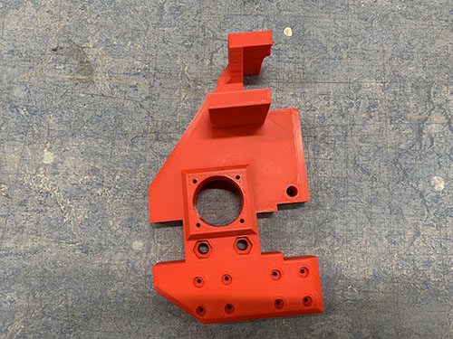                                           | [LEFT\_PLATE.stl](./stl_files/side_plates/left/LEFT_PLATE.stl)                                          | Lock bridge beams |
| SP_002   | Left side plate upper front clip | 1      |          | [LEFT\_PLATE\_UPPER\_FRONT\_CLIP.stl](./stl_files/side_plates/left/LEFT_PLATE_UPPER_FRONT_CLIP.stl)     | Lock bridge beams |
| SP_003   | Left side plate lower front clip | 1      |          | [LEFT\_PLATE\_LOWER\_FRONT\_CLIP.stl](./stl_files/side_plates/left/LEFT\_PLATE\_LOWER\_FRONT\_CLIP.stl) | Lock bridge beams |
| SP_004   | Left side plate back clip        | 1      |  | [LEFT\_PLATE\_BACK\_CLIP.stl](./stl_files/side_plates/left/LEFT_PLATE_BACK_CLIP.stl)                    | Lock bridge beams |

#### Right side plate

| Item no. | Type                              | Amount | Image                                                                                      | STL link                                                                                               | Used for          |
|----------|-----------------------------------|--------|--------------------------------------------------------------------------------------------|--------------------------------------------------------------------------------------------------------|-------------------|
| RP_001   | Right side plate                  | 1      |                                    | [RIGHT\_PLATE.stl](./stl_files/side_plates/right/RIGHT_PLATE.stl)                                      | Lock bridge beams |
| RP_002   | Right side plate upper front clip | 1      | 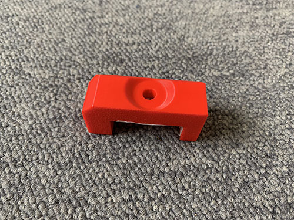 | [RIGHT\_PLATE\_UPPER\_FRONT\_CLIP.stl](./stl_files/side_plates/right/RIGHT_PLATE_UPPER_FRONT_CLIP.stl) | Lock bridge beams |
| RP_003   | Right side plate lower front clip | 1      |  | [RIGHT\_PLATE\_LOWER\_FRONT\_CLIP.stl](./stl_files/side_plates/right/RIGHT_PLATE_LOWER_FRONT_CLIP.stl) | Lock bridge beams |
| RP_004   | Right plate back clip.jpg         | 1      |     | [RIGHT\_PLATE\_BACK\_CLIP.stl](./stl_files/side_plates/right/RIGHT_PLATE_BACK_CLIP.stl)                | Lock bridge beams |

#### Router

| Item no. | Type             | Amount | Image                                                              | STL link                                                          | Used for                    |
|----------|------------------|--------|--------------------------------------------------------------------|-------------------------------------------------------------------|-----------------------------|
| RO_001   | Carriage         | 1      | 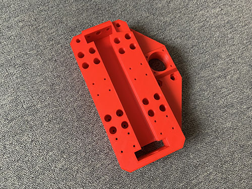                 | [CARRIAGE.stl](./stl_files/router/CARRIAGE.stl)                   | Lock router in place        |
| RO_002   | Router bracket   | 1      |      | [ROUTER\_BRACKET.stl](./stl_files/router/ROUTER_BRACKET.stl)      | Lock router in place        |
| RO_003   | Vaccum funnel    | 1      | 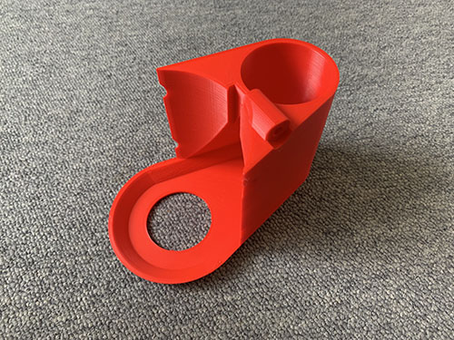       | [VACUUM\_FUNNEL.stl](./stl_files/router/VACUUM_FUNNEL.stl)        | Lock vaccum close to router |
| RO_004   | Vertical slider  | 1      |    | [VERTICAL\_SLIDER.stl](./stl_files/router/VERTICAL\_SLIDER.stl)   | Vertical slider for router  |
| RO_005   | Z motor mount    | 1      | 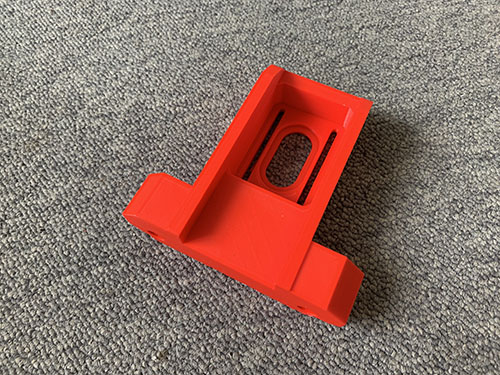       | [Z\_MOTOR\_MOUNT.stl](./stl_files/router/Z_MOTOR_MOUNT.stl)       | Mount z motor to carriage   |
| RO_006   | Vaccum hose ring | 1      |  | [VACUUM\_HOSE\_RING.stl](./stl_files/router/VACUUM_HOSE_RING.stl) | Lock vaccum to carriage     |

### Other parts

#### Nuts

| Type    | Amount | Image                                  | Used for                               |
|---------|--------|----------------------------------------|----------------------------------------|
| M3 nuts | X      | 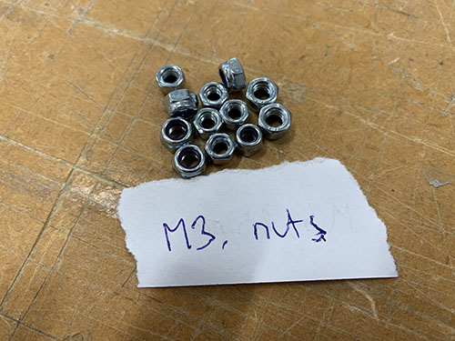 | X                                      |
| M6 nuts | X      |  | X                                      |
| M8 nuts | X      | 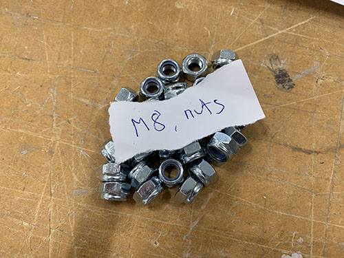 | X                                      |

#### Screws

| Type     | Amount | Image                                                 | Used for                               |
|----------|--------|-------------------------------------------------------|----------------------------------------|
| M3 10 mm | X      | 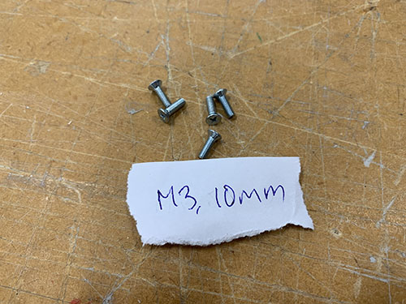 | X                                      |
| M3 16 mm | X      | 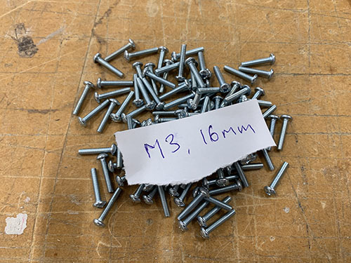 | X                                      |
| M3 20 mm | X      | 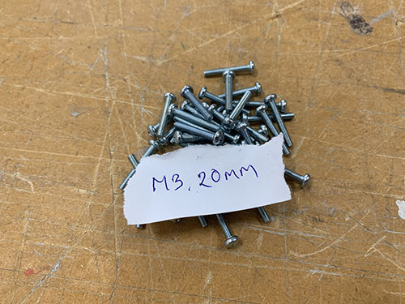 | X                                      |
| M3 25 mm | X      |  | X                                      |
| M5 20 mm | X      | 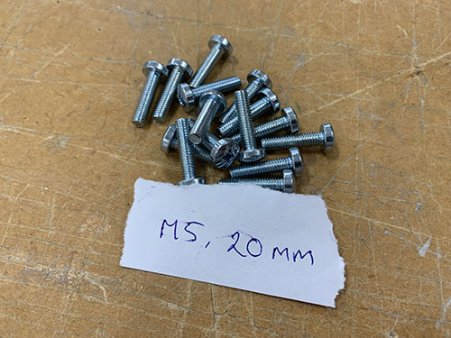 | X                                      |
| M5 30 mm | X      |  | X                                      |
| M5 60 mm | X      |  | X                                      |
| M6 70 mm | X      |  | X                                      |
| M8 80 mm | X      |  | X                                      |

#### Washers

| Type            | Amount | Image                                                                    | Used for                               |
|-----------------|--------|--------------------------------------------------------------------------|----------------------------------------|
| M3              | X      |                              | X                                      |
| 10mm, 20mm, 2mm | X      |  | X                                      |

#### Beams
All beams where cut out from 30mm x 30 mm (2 mm thick) aluminium profiles using a miter saw.

| Type              | Amount | Image                                                                  | Used for                               |
|-------------------|--------|------------------------------------------------------------------------|----------------------------------------|
| Vertical 80 mm    | 8      |        | X                                      |
| Front/Back 677 mm | 4      |  | X                                      |
| Right/Left 900 mm | 4      |  | X                                      |
| Bridge 803 mm     | 3      | 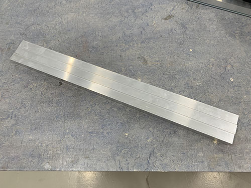         | X                                      |

#### Threaded rods

| Type      | Amount | Image                                                                | Used for                               |
|-----------|--------|----------------------------------------------------------------------|----------------------------------------|
| M5 140 mm | 2      |  | Keep bridge beams together             |
| M8 12 mm  | 8      | 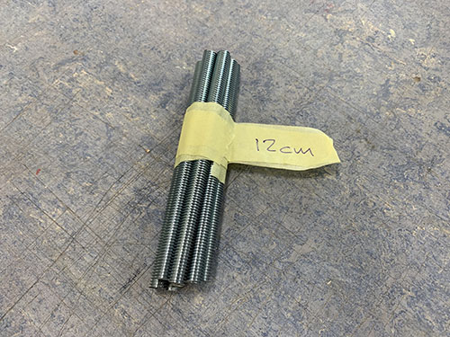 | Keep upper and lower frames together   |
| M8 717 mm | X      |  | Keep frames together                   |