This guide goes through all the steps of building Ivan Miranda's 3d-printed CNC machine and is a complement to Ivan's Youtube-videos:

1. Original video: [https://www.youtube.com/watch?v=_atw3e0nIrg](https://www.youtube.com/watch?v=_atw3e0nIrg)
2. Updates with geared stepper motors etc: [https://www.youtube.com/watch?v=qpjf5D3WngY](https://www.youtube.com/watch?v=qpjf5D3WngY)
3. Updating to metal parts: [https://www.youtube.com/watch?v=RDnGvhdGFEY](https://www.youtube.com/watch?v=RDnGvhdGFEY)

It follows the first and second video quite strict, while only using the added vertical beams from the third video.

# Table of content
.....

# License
The following license is included when buying Ivan Miranda's blueprints of the CNC machine:

```
Everything that is in these files that I produced myself, apart from reselling the files, is allowed.
You can print and sell parts, sell machines, sell courses to build the machine. Modify the parts and post 
them for free, as long as you don’t sell the files and keep this license on everything you make with the 
files and credit me, we’re good. No DRM or anything, you are even allowed to repost the files as long as 
they’re kept free. Why buy this then? To support me and keep me encouraged to do more projects like this. 
```

Ivan does an amazing job putting these DIY builds together. I've posted his STL-files in this repository to simplify the build, but PLEASE buy his blueprints here: [https://ivanmiranda.com/products/3d-printed-cnc](https://ivanmiranda.com/products/3d-printed-cnc). It's only $25 and helps him to continue build and share his awesome projects.

# Parts (bill of materials)
The following chapter goes through all the parts needed to build the CNC machine. There are two sub-sections:

* `3d-printed parts` - All parts that you need to 3d-print
* `Other parts` - All the parts that you need to buy

Each table includes:

* `Item no.` - Item number used to identify the part later in the guide
* `Type` - Name of the part
* `Amount` - Number of units needed
* `Image` - Image of the part
* `(STL link)` - Link to the stl-file if there is any
* `Used for` - Where it's used in the CNC machine

## 3d-printed parts
All the parts below needs to be 3d-printed. The tables include links to the STL-files.

### Left side plates

| Item no. | Type                             | Amount | Image                                                                                            | STL link                                                                                                | Used for          |
|----------|----------------------------------|--------|--------------------------------------------------------------------------------------------------|---------------------------------------------------------------------------------------------------------|-------------------|
| SP_001   | Left side plate                  | 1      |                                            | [LEFT\_PLATE.stl](./stl_files/side_plates/left/LEFT_PLATE.stl)                                          | Lock bridge beams |
| SP_002   | Left side plate upper front clip | 1      |          | [LEFT\_PLATE\_UPPER\_FRONT\_CLIP.stl](./stl_files/side_plates/left/LEFT_PLATE_UPPER_FRONT_CLIP.stl)     | Lock bridge beams |
| SP_003   | Left side plate lower front clip | 1      |          | [LEFT\_PLATE\_LOWER\_FRONT\_CLIP.stl](./stl_files/side_plates/left/LEFT\_PLATE\_LOWER\_FRONT\_CLIP.stl) | Lock bridge beams |
| SP_004   | Left side plate back clip        | 1      |  | [LEFT\_PLATE\_BACK\_CLIP.stl](./stl_files/side_plates/left/LEFT_PLATE_BACK_CLIP.stl)                    | Lock bridge beams |

### Right side plate

| Item no. | Type                              | Amount | Image                                                                                      | STL link                                                                                               | Used for          |
|----------|-----------------------------------|--------|--------------------------------------------------------------------------------------------|--------------------------------------------------------------------------------------------------------|-------------------|
| RP_001   | Right side plate                  | 1      |                                    | [RIGHT\_PLATE.stl](./stl_files/side_plates/right/RIGHT_PLATE.stl)                                      | Lock bridge beams |
| RP_002   | Right side plate upper front clip | 1      |  | [RIGHT\_PLATE\_UPPER\_FRONT\_CLIP.stl](./stl_files/side_plates/right/RIGHT_PLATE_UPPER_FRONT_CLIP.stl) | Lock bridge beams |
| RP_003   | Right side plate lower front clip | 1      |  | [RIGHT\_PLATE\_LOWER\_FRONT\_CLIP.stl](./stl_files/side_plates/right/RIGHT_PLATE_LOWER_FRONT_CLIP.stl) | Lock bridge beams |
| RP_004   | Right plate back clip.jpg         | 1      |     | [RIGHT\_PLATE\_BACK\_CLIP.stl](./stl_files/side_plates/right/RIGHT_PLATE_BACK_CLIP.stl)                | Lock bridge beams |

### Router

| Item no. | Type             | Amount | Image                                                              | STL link                                                          | Used for                    |
|----------|------------------|--------|--------------------------------------------------------------------|-------------------------------------------------------------------|-----------------------------|
| RO_001   | Carriage         | 1      |                  | [CARRIAGE.stl](./stl_files/router/CARRIAGE.stl)                   | Lock router in place        |
| RO_002   | Router bracket   | 1      |      | [ROUTER\_BRACKET.stl](./stl_files/router/ROUTER_BRACKET.stl)      | Lock router in place        |
| RO_003   | Vaccum funnel    | 1      |        | [VACUUM\_FUNNEL.stl](./stl_files/router/VACUUM_FUNNEL.stl)        | Lock vaccum close to router |
| RO_004   | Vertical slider  | 1      |    | [VERTICAL\_SLIDER.stl](./stl_files/router/VERTICAL\_SLIDER.stl)   | Vertical slider for router  |
| RO_005   | Z motor mount    | 1      |        | [Z\_MOTOR\_MOUNT.stl](./stl_files/router/Z_MOTOR_MOUNT.stl)       | Mount z motor to carriage   |
| RO_006   | Vaccum hose ring | 1      |  | [VACUUM\_HOSE\_RING.stl](./stl_files/router/VACUUM_HOSE_RING.stl) | Lock vaccum to carriage     |

### Belt tensioners

| Item no. | Type                    | Amount | Image                                                                                                        | STL link                                                                                                       | Used for               |
|----------|-------------------------|--------|--------------------------------------------------------------------------------------------------------------|----------------------------------------------------------------------------------------------------------------|------------------------|
| BT_001   | Y axis left back clip   | 1      |       | [Y\_AXIS\_LEFT\_BACK\_CLIP.stl](./stl_files/belt_tensioner/y_axis_left/Y_AXIS_LEFT_BACK_CLIP.stl)              | Lock left y-axis belt  |
| BT_002   | Y axisleft front clip   | 1      |     | [Y\_AXIS\_LEFT\_FRONT\_CLIP.stl](./stl_files/belt_tensioner/y_axis_left/Y_AXIS_LEFT_FRONT_CLIP.stl)            | Lock left y-axis belt  |
| BT_003   | Y axis left tensioner   | 1      |       | [Y\_AXIS\_LEFT\_BELT\_TENSIONER.stl](./stl_files/belt_tensioner/y_axis_left/Y_AXIS_LEFT_BELT_TENSIONER.stl)    | Lock left y-axis belt  |
| BT_004   | Y axis right back clip  | 1      |    | [Y\_AXIS\_RIGHT\_BACK\_CLIP.stl](./stl_files/belt_tensioner/y_axis_right/Y_AXIS_RIGHT_BACK_CLIP.stl)           | Lock right y-axis belt |
| BT_005   | Y axis right front clip | 1      |  | [Y\_AXIS\_RIGHT\_FRONT\_CLIP.stl](./stl_files/belt_tensioner/y_axis_right/Y_AXIS_RIGHT_FRONT_CLIP.stl)         | Lock right y-axis belt |
| BT_006   | Y axis right tensioner  | 1      |    | [Y\_AXIS\_RIGHT\_BELT\_TENSIONER.stl](./stl_files/belt_tensioner/y_axis_right/Y_AXIS_RIGHT_BELT_TENSIONER.stl) | Lock right y-axis belt |
| BT_007   | X axis back clip        | 1      |                      | [Y\_AXIS\_X\_AXIS\_BACK\_CLIP.stl](./stl_files/belt_tensioner/x_axis/X_AXIS_BACK_CLIP.stl)                     | Lock x-axis belt       |
| BT_008   | X axis front clip       | 1      |                    | [Y\_AXIS\_X\_AXIS\_FRONT\_CLIP.stl](./stl_files/belt_tensioner/x_axis/X_AXIS_FRONT_CLIP.stl)                   | Lock x-axis belt       |

## Other parts
All the parts below needs to be bought or cut out.

### Nuts

| Type    | Amount | Image                                  | Used for                               |
|---------|--------|----------------------------------------|----------------------------------------|
| M3 nuts | X      |  | X                                      |
| M6 nuts | X      |  | X                                      |
| M8 nuts | X      |  | X                                      |

### Screws

| Type     | Amount | Image                                                 | Used for                               |
|----------|--------|-------------------------------------------------------|----------------------------------------|
| M3 10 mm | X      |  | X                                      |
| M3 16 mm | X      |  | X                                      |
| M3 20 mm | X      |  | X                                      |
| M3 25 mm | X      |  | X                                      |
| M5 20 mm | X      |  | X                                      |
| M5 30 mm | X      |  | X                                      |
| M5 60 mm | X      |  | X                                      |
| M6 70 mm | X      |  | X                                      |
| M8 80 mm | X      |  | X                                      |

### Washers

| Type            | Amount | Image                                                                    | Used for                               |
|-----------------|--------|--------------------------------------------------------------------------|----------------------------------------|
| M3              | X      |                              | X                                      |
| 10mm, 20mm, 2mm | X      |  | X                                      |

### Beams
All beams where cut out from 30mm x 30 mm (2 mm thick) aluminium profiles using a miter saw.

| Type              | Amount | Image                                                                  | Used for                               |
|-------------------|--------|------------------------------------------------------------------------|----------------------------------------|
| Vertical 80 mm    | 8      |        | X                                      |
| Front/Back 677 mm | 4      |  | X                                      |
| Right/Left 900 mm | 4      |  | X                                      |
| Bridge 803 mm     | 3      |          | X                                      |

### Threaded rods

| Type      | Amount | Image                                                                | Used for                               |
|-----------|--------|----------------------------------------------------------------------|----------------------------------------|
| M5 140 mm | 2      |  | Keep bridge beams together             |
| M8 12 mm  | 8      |  | Keep upper and lower frames together   |
| M8 717 mm | 4      |  | Keep frames together                   |

### Others

| Item no. | Type                             | Amount | Image                                                          | Used for                   |
|----------|----------------------------------|--------|----------------------------------------------------------------|----------------------------|
| OT_001   | NEMA17 1:19 geared stepper motor | 3      |              | Move X & Y axis            |
| OT_002   | NEMA17 stepper motor             | 1      |          | Move Z axis                |
| OT_003   | HTD5M 4 meter belt               | 1      |                    | Belt to move X & Y axis    |
| OT_004   | HTD5M 12 teeth pulley            | 3      |                | Pulleys to move X & Y axis |
| OT_005   | 2GT belt 300 mmm                 | 1      |          | Belt to move Z axis        |
| OT_006   | 2GT 16 teeth pulley              | 1      |  | Pulley to move Z axis      |
| OT_007   | 2GT 60 teeth pulley              | 1      |  | Pulley to move Z axis      |
| OT_008   | Acme threaded rod 300 mm (8x8mm) | 1      |      | To move Z axis             |
| OT_009   | Acme threaded rod nut            | 1      |                        | To move Z axis             |
| OT_010   | KFL08 rod bearing                | 2      |      | To move Z axis             |
| OT_011   | MGN12H rail 600 mm               | 4      |    | To move X & Y axis         |
| OT_012   | MGN12H rail 200 mm               | 2      |    | To move Z axis             |
| OT_013   | MGN12H block                     | 12     |      | To move all axis           |
| OT_014   | Cable chain 1 meter              | 2      |  | Encapsulate cables         |
| OT_015   | 698zz bearing                    | 18     |              | Ilders for HTD5M belt      |

# Build the CNC machine
This section covers how all the parts is put together to build the CNC machine. 

All the measurements, distances etc can be found in the main project Fusion 360 CAD design that is included when buying Ivan's blueprints. The blueprints can be bought here for just \$25: [https://ivanmiranda.com/products/3d-printed-cnc](https://ivanmiranda.com/products/3d-printed-cnc)

## Main frame

### Cut out holes in the 900 mm profiles
The main frame consists of two separate frames, the lower and the upper frame. The two frames are kept together using threaded rods, washers and nuts. To enable the threaded rods to slide through the aluminium profiles, holes needed to be drilled.

First, a sharpie was used to indicate where all the holes were going. This was done by using a set square and a penn. A bradawl and a hammer were then used to make indentations at the center of the holes.


A 9 mm drill-bit and a bench drill was used to drill the holes straight through the profiles.


To be able to access the nuts and tight them with a socket wrench, some holes (facing outwards) needed to be enlarged. A sharpie was used to mark all the holes that needed to be enlarged.


A step drill was then used to enlarge the holes holes to 20 mm. A tip is to measure the size of your socket wrench and keep the holes as small as possible, while you're still able to tighten the nuts. To be able to see which step you're aiming for on the step drill, attach a small piece of masking tape on the step above.


The edges were finally smoothed out using a round metal file.


### Attach rails to 900 mm profiles

Before the upper and lower frames were assembled, two 600 mm MGN12H rails were attached to the 900 mm aluminium profiles of the **upper** frame. They were attached to the sides facing outwards and above the three 80 mm vertical beams (connecting the lower and upper frame). A tip is to place all the profiles as they should go to make sure that you're attaching the rails to the correct faces (see the red boxes on the image below). Also, be very careful when removing the MGN12H blocks from the rails.


Three 3d-printed support tools were used to center the rails on the profiles. A 57 mm wood block were cut out and used to attach the rails at the same distance from the end of the profiles. The rails were then clamped to the profiles.


A bradawl and a hammer were then used to make indentations at the center of the holes. Cutting fluid were applied and a 2 mm drill was used to drill all the holes.


Cutting fluid was then applied once more on the drilled holes and a M3 drill tap was used to create threads in the holes.


Finally, the rails were attached using 20 mm M3 screws.


### Assemble upper and lower frames

The two frames were assembled using the longer 717 mm M8 threaded rods, (10mm, 20mm, 2mm) washers and M8 lock nuts.

The profiles were first placed in their correct place and clamps were used to keep the profiles aligned. I used two jointed spanners (one one each side) to lock everything in place, but you can also use two socket wrenches. Just make sure that the bits fit into the drilled holes.


### Interlock upper and lower frames

The upper and lower frames and the 80 mm vertical aluminium beams were first layed out in their correct place. The 803 mm horizontal bridge beams and clamps were then used to align the frames on top of each other.


The 120 mm M8 threaded rods, (10mm, 20mm, 2mm) washers and M8 lock nuts were then used to interlock the upper and lower frames, with the 80 mm vertical aluminium profiles in between.


### Attach side plates

Before attaching the side plates, the MGN12H blocks were added back onto the rails, two on each side. Be careful when sliding them onto the rails, there are multiple small bearing balls that easily fall out of the blocks.

The left and right side plates where then attached to the blocks using 20 mm M3 screws. Make sure to attach the plates on the correct side (see images below).


I had to redesign the left side plate and reprint it later in the build (after the images were taken). Therefore, the left side plate seen in the upcoming images look a bit different than the one used (see next image for the left side plate used).


### Attach motors, idlers and pulleys to side plates

Each idler were made up out of one 60 mm fully threaded M8 screw, 3 698zz bearings and 6 (10 mm x 8 mm x 2 mm) washers (3 on each side of the bearings). Two idlers were then attached to each side plate using two M8 nuts. Make sure that the bearings are spinning freely.


To attach the stepper motors to the side plates, the 4 M3 screws locking the gear box to the motor were removed. Save these as they will be used later on to attach the power supply and Arduino.


The stepper motors were then inserted into the large holes on the side plates, facing inwards. 4 40 mm M3 screws and 4 M3 washers were used to lock each stepper motor to the side plates (I forgot to add the washers in the images below, therefore they're not visible). The motors should be attached so that the cables are facing in the direction of the two bridge beams (i.e. the longer vertical surface of the side plates).


The HTD5M timing pulleys were attached to the motor shaft using set screws.


### Attach Y-axis belt tensioners and end-stop mounts

Fixed belt tensioners were attached to the longer aluminium profiles of the upper frame using M5 screws. When aligning the fixed belt tensioners, make sure that the "belt opening" is pointing in the direction of the rails (one fixed belt tensioner for each rail). Similar to before, a bradawl and a hammer were used to make indentations at the center of the holes. Cutting fluid were applied and a 4 mm drill was used to drill the holes, followed by a M5 drill tap.


The belt tension sliders were attached on the opposite side of the fixed belt tensioners, ontop of the aluminium profile. To get them aligned at the exact same place on both sides, a 100 mm distance was cut out and a flat support was clamped to the inner side of the profile. The same drill and tap size were used as for the fixed belt tensioners (4mm drill, M5 drill tap). Make sure that the belt tension sliders are pointing outwards.


The end-stop mounts were then attached to the same side as the belt tension sliders using M5 screws, facing outwards and aligned with the rails. 


The belt tensioners were loosely attached to the belt tension sliders using fully threaded M8 screws, M8 locknuts and (20mm x 10mm x 2mm) washers.


### Add Y-axis HTD5M belts

The HTD5M belt was first inserted into one of the fixed belt tensioners using a flat screw driver. It was then stretched along the aluminium profile, below the first idler, around the timing pulley, below the second idler and all the way to the belt tensioner.


A scissor was used to cut the belt at an appropriate length. The loose end was then inserted into the belt tensioner using a flat screw driver and the belt was stretched by tightning the M8 locknut.


Make sure that the belt is not too loose and not too tight.


Repeat on the other side.

### Attach rails to bridge beams

The last two 600 mm MGN12H rails were attached to two of the 803 mm aluminium bridge beams (used for the X-axis). First, the MGN12H blocks were carefully removed from the rails.


The same 100 mm distance used to align the belt tension sliders were used to align the rails. Because they will be off center by 3 mm, make sure that you later attach the bridge beams to the side plates in a way so	 the rails line up. 

The same 3d-printed support tools used to align the rails on the 900 mm aluminium profiles were used here as well. Everything was clamped into position. A bradawl and a hammer were used to make indentations and a 2 mm drill and a M3 drill tap was used to make the screw holes.


The rails were finally attached using 20 mm M3 screws and the rail blocks were gently slided back onto the rails.


#### Attach fixed tensioner and end-stop mount to the lower bridge beam

The fixed tensioner and end-stop mount were attached to the lower bridge beam in the same fashion as on the 900 mm aluminium profiles, using M5 screws. When aligning the fixed tensioner, make sure that the "belt opening" is pointing in the direction of the rail. A bradawl and a hammer were used to make indentations at the center of the holes. Cutting fluid were applied and a 4 mm drill was used to drill the holes, followed by a M5 drill tap.


#### Attach bridge beams to side plates

All three bridge beams were then inserted into the slots on the side plates. Make sure that the two beams with the rails are on top of each other, with the rails pointing outwards. Also, make sure that you insert them in the correct orientation, so that the rails are lined up (due to the rails being 3 mm off center).


When the bridge beams were aligned, the blockers were placed in their correct place and a sharpie was used to mark the center of the holes to be drilled. Similar to before, a bradawl and a hammer were used to make indentations at the center of the holes.


A 7 mm drill bit was used to drill the holes. As these holes were going straight through the profiles, a bench drill was used for precision. A metal file was used to remove all excess metal around the holes.


The bridge beams were then inserted into the slots on the side plates once more, along with all the blockers. A 140 mm threaded M5 rod was inserted through the bottom two beams and a 60 mm M5 screws was inserted through the top bridge beam. It was all tightened using M5 nuts.


#### Attach bearings to carriage

Before attaching the carriage to the bridge beams, two KFL08 rod bearings were attached on the top and the bottom of the carriage (inside) using 20 mm M5 screws and M5 locknuts. A tip is to temporarily use the acme rod (used in an upcoming step) to vertically align the two bearings.


#### Attach carriage to bridge beams

The carriage was attached to the four MGN12H blocks on the bridge beams, using 25 mm M3 screws.


#### Attach motor, idlers and pulley to carriage

The two belt idlers were attached to the carriage in the same way as to the side plates. Each idler were made up out of one 60 mm fully threaded M8 screw, 3 698zz bearings and 6 (10 mm x 8 mm x 2 mm) washers (3 on each side of the bearings). The two idlers were then attached to the carriage using two M8 nuts. Make sure that the bearings are spinning freely.

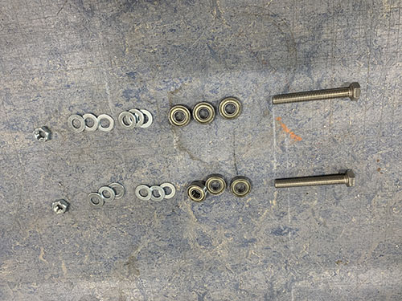


To attach the stepper motor to the carriage, the 4 M3 screws locking the gear box to the motor were removed.


The stepper motor was then inserted into the large hole on the carriage, facing towards the bridge beams/idlers. 4 40 mm M3 screws and 4 M3 washers were used to lock the stepper motor onto the carriage. The motor should be attached so that the cables are facing upwards.


The HTD5M timing pulley was attached to the motor shaft using set screws.


#### Add X-axis HTD5M belt

The HTD5M belt was first inserted into the fixed belt tensioner using a flat screw driver. It was then stretched along the aluminium profile, below the first idler, around the timing pulley, below the second idler and all the way to the other side.

The belt was cut at an appropriate length and inserted into the belt tensioner using a flat screw driver.


The belt tensioner was then attached to the side plate using a fully threaded M8 screw, a M8 locknut and a (20mm x 10mm x 2mm) washer. The M8 screw in the image is not fully threaded as I lost the one I was suppose to use and had to use another one, so please ignore :)


Make sure that the belt is not too loose and not too tight.


#### Attach acme nut and rails to carriage slider

An acme nut was inserted from the outside, into the the center hole at the top of the vertical carriage slider. It was locked in place using 4 25 mm M3 screws.


The two smaller 200 mm MGN12H rails were then attached to the back of the vertical carriage slider. First, the MGN12H blocks were carefully removed from each rail. After that, the rails were screwed in place on the back of the vertical carriage slider using 20 mm M3 screws. The MGN12H blocks were then slided back on and each end were blocked using tape. 


#### Attach acme rod and vertical slider to carriage

To attach the vertical slider to the carriage, 25 mm M3 screws were first inserted into the holes on the carriage. You might need to "open up" the holes using a narrow tool (depending on the direction you 3d-printed the carriage).


The acme rod was then inserted through the two KFL08 rod bearings and the acme nut, and the set screws on the bearings were tightened.


The vertical slider was finally attached to the carriage by attaching the 25 mm M3 screws to the MGN12H blocks on the vertical slider.


#### Attach Z motor mount and X-axis cable chain

The first step was to find a good length of the X-axis cable chain. To simplify this process, the X-axis belt was removed to easier move the carriage along the X-axis.


The Z motor mount and the X-axis cable chain mount were then assembled using 3 25 mm M4 screws, 3 M4 nuts and 3 (8mm x 4mm x 0.5mm) washers.


They Z motor mount was then attached to the carriage using 2 80 mm M8 screws, 2 M8 nuts and 2 (20mm x 10mm x 2mm) washers. The vaccum mount was also inserted and attached to the right-side M8 screw. Please ignore the timing pulley attached to the acme rod in some of the images, it will be attached in a later step.


A 1 meter cable chain were then clamped to the cable chain mount and to the back-side bridge beam. The carriage was then moved as far to the sides as possible. It's important that the chain doesn't touch any of the side plates when moved. In my case, I had to remove 3 links from the cable chain to get a good length of the chain.


The Z motor mount and cable chain mount were then disassembled and the cable chain was properly attached to the cable chain mount using 2 25 mm M4 screws, 2 M4 nuts and 2 (8mm x 4mm x 0.5mm) washers.


The Z motor mount and cable chain mount were then assembled again and attached to the carriage in the same fashion as before.


The carriage was move all the way to the right side plate and the cable chain was clamped to the back-side bridge beam.


A bradawl and a hammer were used to make indentations at the center of the two holes. Cutting fluid were applied and a 3 mm drill was used to drill the holes, followed by a M4 drill tap. The cable chain was then attached to the bridge beam using 2 25 mm M4 screws.


Finally, the X-axis belt was reattached and tightened.


#### Attach Y-axis cable chain

The Y-axis cable chain was attached using two supports. The first support (with screw holes to attach the cable chain) was clamped to the left side of the lower frame and aligned with the last vertial beam. A bradawl and a hammer were used to make indentations at the center of the two holes. Cutting fluid were applied and a 4 mm drill was used to drill the holes, followed by a M5 drill tap. The support was then attached to the lower frame using 2 20 mm M5 screws.


The second support was only attached to the lower frame for the cable chain to rest on. I aligned and attached it at the center between the second and third vertical beam. Make sure that it does not go below the bottom frame!

In the same way as the first support, a bradawl and a hammer were used to make indentations at the center of the two holes. Cutting fluid were applied and a 4 mm drill was used to drill the holes, followed by a M5 drill tap. The support was then attached to the lower frame using 2 20 mm M5 screws.


The Y-axis cable chain was then attached to the left side plate and lower frame support using 4 25 mm M4 screws, 4 M4 nuts and 4 (8mm x 4mm x 0.5mm) washers.


#### Attach Z stepper motor, pulleys and belt


#### Solder stepper motor cables

##### Y-axis 1


##### Y-axis 2


##### X-axis


##### Z axis


#### Attach endstops and endstop cables

#### X axis (max)


#### X axis (min)


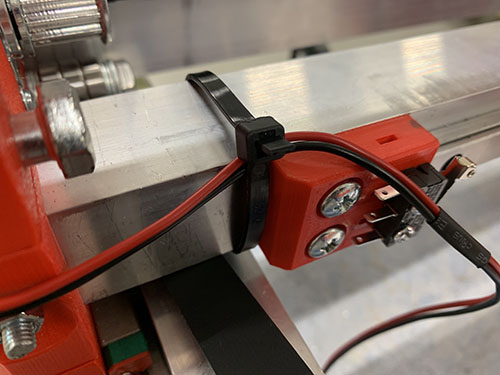


#### Y axis (max)


#### Y axis (min)


#### Stepper motor cable management


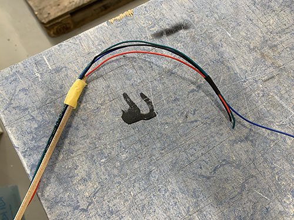


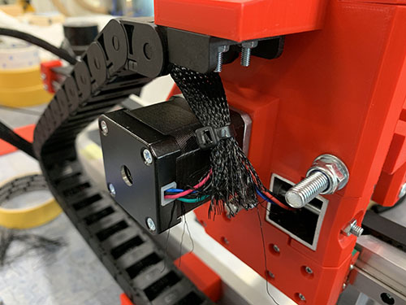

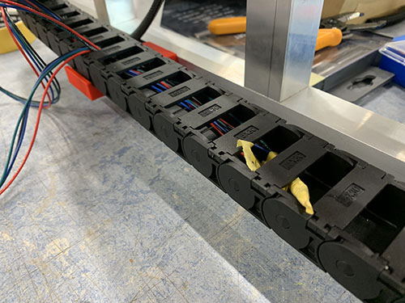


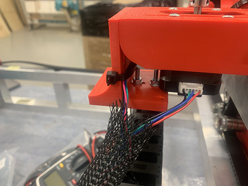

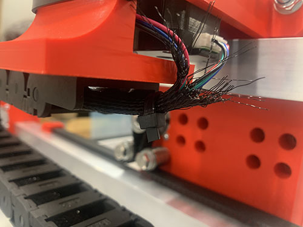

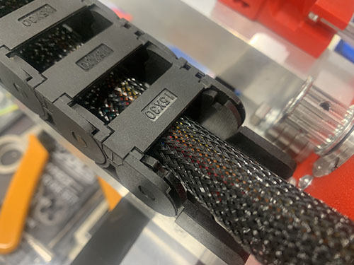

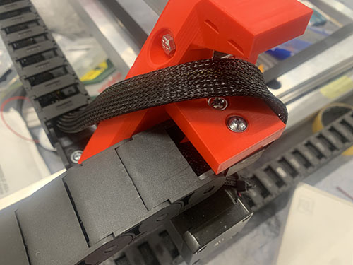

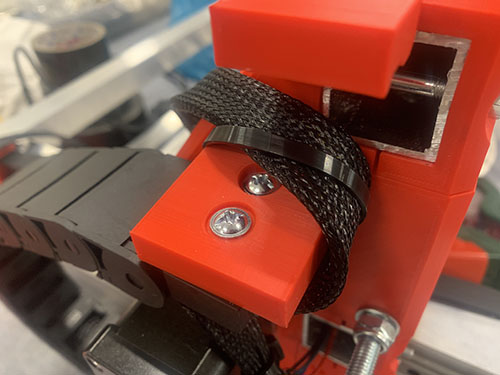

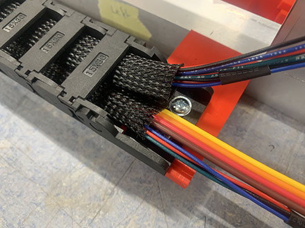

### Connect main electronic box


### Connect fans and LED


### Install CNC software on Arduino Uno

The software used in this project to control the CNC machine is called `grbl`. It's an open source and high performance g-code-parser and CNC milling controller that can run on a straight Arduino. To be able to install the software on the Arduino, you will need a computer.

#### Install Arduino Software (IDE)
To be able to install `grbl` on the Arduino, the `Arduino Software (IDE)` needs to be installed on your computer. This program is used to upload code to the Arduino. Download the program from this website and follow the instructions: 

[https://www.arduino.cc/en/software](https://www.arduino.cc/en/software)

When starting the program, you should see something similar to this:


#### Install `grbl`
After installing the Arduino Software, the latest stable version of `grbl` was downloaded (as zip-format) from their official GitHub release page: 

[https://github.com/gnea/grbl/releases](https://github.com/gnea/grbl/releases)

After unzipping the file, you should see something similar to this in the folder:


Now, open the `Arduino Software (IDE)` and click `Sketch > Include Library > Add .ZIP Library...` in the top menu:


You should see a pop-up similar to this:


Find the unzipped folder, open it and choose the folder `grbl`. After choosing the folder, you should see a text below the editor saying `Library added to your libraries. Check "Include library" menu`.

Next, connect the Arduino to your computer. It should fire up right away as it uses the computer as a power source.

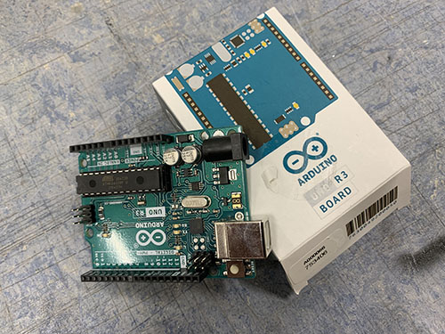

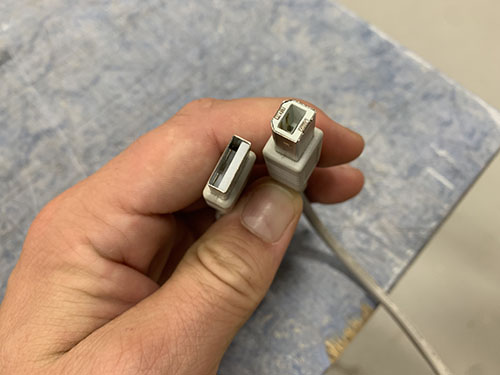


To let the IDE know where to upload the software, we first need to set the correct serial port and board. To set the serial port, find the correct one under `Tools > Port > SOMETHINGSOMETHING (Arduino Uno)`.


To set the board, find "Arduino Uno" under `Tools > Board > Arduino Uno`.


To test if you've chosen the correct board and serial port, compile the template code by clicking on the check mark in the top left corner. When compiling is done, click the right-pointing arrow to upload the code to the Arduino. If successfull, you should see a text saying `Done uploading` below the editor.


It's now time to upload `grbl` to the Arduino. To do this, click `File > Open` in the top menu:


This should open a pop-up window. Find the downloaded folder and open `grbl/examples/grblUpload/grblUpload.ino`:


A new editor should pop-up:


Similar as before, compile the code by clicking on the check mark. When done, upload the code to the Arduino by clicking on the right-pointing arrow. This should only take a couple of seconds. `grbl` is now installed on the Arduino!


### Connect power to Arduino
